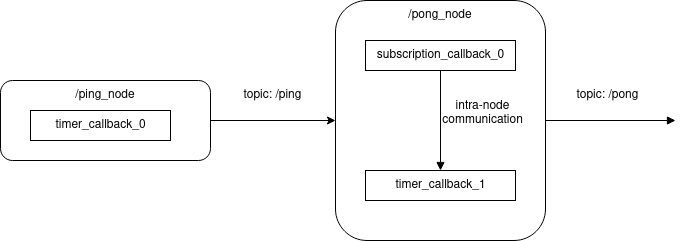
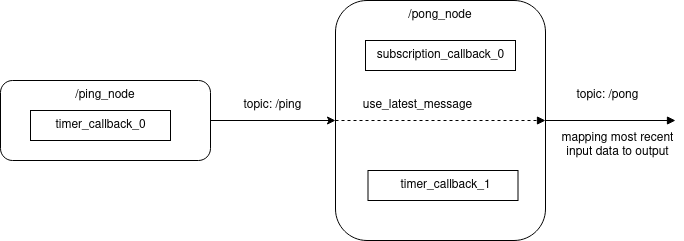
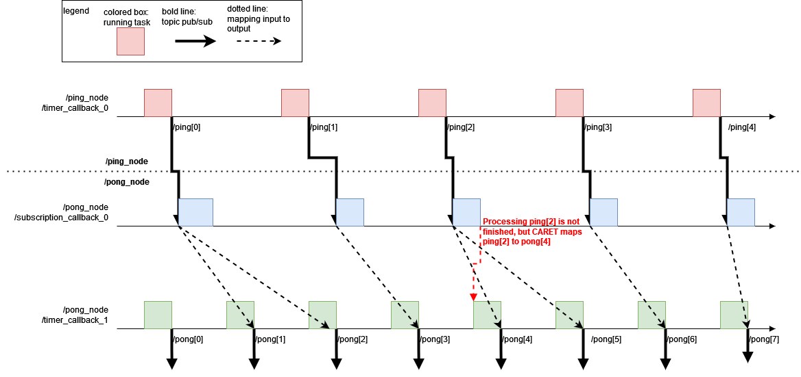
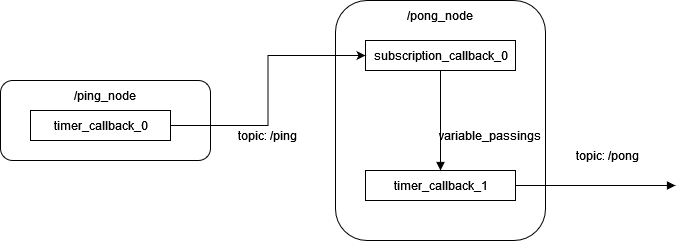
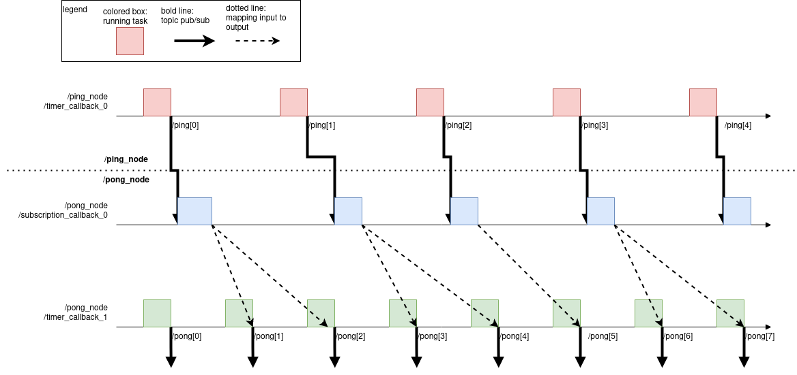

# ノード内データパスの定義方法

前のセクションでは、ノード間のデータ パスを定義する方法を学習しました。CARET は、ノード間データ パス定義のみを使用して単純なパスの応答時間を計算できます。ただし、対象となるアプリケーションやパスが複雑になると、ノード間のデータパスだけでなくノード内のデータパスも定義する必要があります。

CARET は、ノード内データ パスがトピック サブスクリプションのマッピングであると想定し、ノードで公開します。これは単に実装に依存するため定義されていません。

このセクションでは、定義する必要があるノード内データ パスを見つける方法と、それを定義する方法について説明します。

## 定義するノード内データ パスを見つける

ノード内データ パスを定義する前に、ターゲット パスのレイテンシが計算可能かどうかを確認する必要があります。これは、次のサンプルコードに示すように、`Path.verify()` メソッドで確認できます。

```python
arch = Architecture('yaml', '/path/to/architecture.yaml')

path = arch.get_path('target_path')
path.verify()
```

ここで、`path` のパス レイテンシが計算可能な場合、`path.verify()` は `True` を返します。そうしないと、以下に示すような警告メッセージが表示されます。

例1.

```python
WARNING : 2021-12-20 19:14:03 | Detected "message_contest is None". Correct these node_path definitions.
To see node definition and procedure,execute :
>> check_procedure('yaml', '/path/to/yaml', arch, '/message_driven_node')
message_context: null
node: /message_driven_node
publish_topic_name: /topic3
subscribe_topic_name: /topic2

WARNING : 2021-12-20 19:14:03 | Detected "message_contest is None". Correct these node_path definitions.
To see node definition and procedure,execute :
>> check_procedure('yaml', '/path/to/yaml', arch, '/timer_driven_node')
message_context: null
node: /timer_driven_node
publish_topic_name: /topic4
subscribe_topic_name: /topic3
```

例2.

```python
WARNING : 2022-03-18 12:53:54 | 'caret/rclcpp' may not be used in subscriber of '/topic/name'.
```

`Example 1`、`/message_driven_node`、および `/timer_driven_node` のサンプル警告メッセージには、未定義のノード内データ パスがあります。次のステップでノード内データ パスを追加します。

もう 1 つのメッセージ `Example 2` では、`/topic/name` トピックをサブスクライブするノードが caret/rclcpp でコンパイルされていません。
[here](../recording/build_check.md#how-to-fix)を確認してください。

## メッセージコンテキスト

CARET は、ノードのレイテンシがサブスクリプション時間からパブリッシュ時間までの期間として定義されていることを前提としています。定義は単純に見えますが、一部のノードには複数の入力または複数の出力があるため、ノードのレイテンシを機械的に定義するのは困難です。

CARET では、ノードのレイテンシーを計算するためにユーザーが **`message_context`** を定義する必要があります。`message_context` には次のポリシーのいずれかが使用できます。

- `use_latest_message`
- `callback_chain`

これらはノード レイテンシを測定するための異なる機能を備えており、選択された `message_context` ポリシーによってノード レイテンシの計算方法が決定されます。ただし、`message_context` は、例がない CARET 初心者にとっては少し難しいです。後続のセクションでは、ポリシーを説明する前に問題の例を紹介します。

これら 2 つのポリシーは、任意のノード レイテンシをカバーするには十分ではなく、実装によっては測定できないノード レイテンシが発生する場合があります。
たとえば、メッセージ フィルターは現在測定できません。

### 例題

以下の図に示すように、`/ping_node` および `/pong_node` に関する問題の例が示されています。



次の項目では、`/ping_node` と `/pong_node` について説明します。

- `/ping_node`
  - `/ping` トピックのメッセージを `/pong_node` に送信します
  - 単一のコールバック関数で構成されます
- `/pong_node`
  - `/pong` トピックのメッセージを別のノードに送信します
  - 2 つのコールバック関数で構成されます。`subscription_callback_0` および `timer_callback_1`
  - `subscription_callback_0` 経由で `/pong_node` から `/ping` トピックのメッセージを受信します
  - `subscription_callback_0` は、共有変数を介してメッセージ `/ping` トピックを `timer_callback_1` と共有します
  - `timer_callback_1` は共有メッセージを含む `/pong` を生成します
  - `timer_callback_1` は `timer_callback_0` の約 8/5 の頻度で実行されます。

CARET は、どの入力トピック メッセージが出力メッセージにマップされるかに関係します。`message_context` は、入力メッセージを出力メッセージにマップするために提供されます。

### `use_latest_message`

`use_latest_message` ポリシーを使用すると、CARET は最新の入力メッセージを出力メッセージにマップします。CARET は入力と出力に焦点を当てていますが、ノード構造の構造には関係しません。次の図は、問題例で CARET が `use_latest_message` でノード レイテンシを定義する方法を示しています。



図では、`ping` トピックの最新メッセージが CARET によって機械的に `/pong` トピックのメッセージにマッピングされています。ブロック図だけではまだ分かりにくいですが、以下のタイミングチャートを見れば`use_latest_message`が何なのかを理解するのに役立ちます。



タイミング チャートでは、色付きのボックスはコールバックの実行時間を表し、太線はトピック メッセージのメッセージ フローを表します。点線は、入力メッセージと出力間のマッピングを示します。`use_latest_message` の場合、CARET は、出力メッセージが最新の入力メッセージから作成されることを前提としています。`use_latest_message` は非常にシンプルで、ほとんどの場合にうまく機能します。

タイミングチャートの赤点線は`use_latest_message`の落とし穴を説明しています。`use_latest_message` ポリシーを使用すると、CARET は、完全には処理されていない入力メッセージが出力メッセージにマップされていると考えます。たとえば、CARET は、`/ping[2]` が `/pong[4]` の最近の入力メッセージであるため、`/pong[4]` が `/ping[2]` から作成されたと解釈します。ただし、`subscription_callback_0` は `/ping[2]` を処理しており、`/pong[4]` を公開する前に `timer_callback_1` と共有しません。このような落とし穴を見つけた場合は、ノード構造を CARET に通知する必要があります。

### `callback_chain`

`callback_chain` は、複数のコールバック関数の相互運用に基づいて入力メッセージを出力にマップするために CARET に導入されました。入力メッセージはサブスクリプション コールバックで消費され、他のノードに伝播されます。入力メッセージが複数のコールバックのチェーンを通過して出力メッセージを作成しているように見えます。`callback_chain`、CARET を使用すると、コールバックでの入力伝播が処理され、前述の `use_latest_message` の制限を回避するのに役立ちます。

次の図は、CARET が `callback_chain` を使用してノード内データ パスを解釈する方法を示しています。`subscription_callback_0` と `timer_callback_1` の間の内部通信は、ノード内データ パスの定義に考慮されます。`variable_passings`はCARETで使用されるタグであり、このような内部通信を表します。



次のタイミング チャートは、入力メッセージが出力メッセージにどのようにマッピングされるかを示しています。



CARET は、`/pong` トピックのメッセージを、`subscription_callback_0` で処理が終了した `/ping` のメッセージに機械的にマップします。`use_latest_message` の予期しない動作は `callback_chain` によって改善されます。

`callback_chain` が最良の選択と思われます。ただし、いくつかの欠点があります。

- 複数のコールバックを並行して実行するノード向けに設計されていないため、応答時間が実際より長くなる可能性があります。
- CARET のみ ROS 2 のユーザー コードをトレースしないため、バッファリングされたデータが消費される実際の時間を検出できません。
- ユーザーはノード構造を事前に知っていることが期待されます

<prettier-ignore-start>
!!! info
    `use_latest_message` と `callback_chain` は、CARET のすべてのユースケースをカバーしているわけではありません。私たち CARET 開発チームは、ノード内データ パス定義の改善を続けています。
<prettier-ignore-end>

## アーキテクチャ ファイル/オブジェクトへのノード内データ パスを定義します

ノード間データ パスのレイテンシを測定するには、測定対象のアプリケーションのエンティティに一致するようにアーキテクチャ ファイルを編集する必要があります。

ノード間のデータ パスを定義するには 2 つの方法があります。

1. エディタなどでアーキテクチャファイルを直接編集する
2. Python APIを使用したアーキテクチャオブジェクトの操作

どちらの方法でも、正しく定義されていれば同じ結果が得られるため、必要に応じてデータ パスを定義します。

### ファイルを直接編集する

ここでは、アーキテクチャファイルを編集してノード内データパス定義を追加する方法について説明します。上記の例の問題は説明のために使用されています。

#### `use_latest_message`

次のサンプルの説明は、アーキテクチャ ファイルで `use_latest_message` を使用する場合に必要です。次のサンプル記述では、`use_latest_message` が `/pong_node` に適用されます。重要な説明は次のスニペットに抜粋されていますが、サンプルではなく実際に忙しい YAML ファイルに直面することになります。

対象のサブスクリプションとパブリッシャーの間に `use_latest_message` を `context_types` として追加する必要があります。

```yml
- node_name: /pong_node
  callbacks:
    - callback_name: subscription_callback_0
    - callback_name: timer_callback_1
  publishes:
    - topic_name: /pong
      callback_names:
        - timer_callback_1 # manually added
  subscribes:
    - topic_name: /ping
      callback_name: subscription_callback_0
  message_contexts:
    - context_type: use_latest_message # manually added
      subscription_topic_name: /ping
      publisher_topic_name: /pong
```

#### `callback_chain`

一方、CARET では、`callback_chain` を `/pong_node` に適用する場合、ユーザーは次の記述を要求します。

```yml
- node_name: /pong_node
  callbacks:
    - callback_name: subscription_callback_0
    - callback_name: timer_callback_1
  variable_passings:
    - callback_name_write: subscription_callback_0 # manually added
      callback_name_read: timer_callback_1 # manually added
  publishes:
    - topic_name: /ping
      callback_names:
        - timer_callback_1 # manually added
  subscribes:
    - topic_name: /pong
      callback_name: timer_callback_1
  message_contexts:
    - context_type: callback_chain # manually added
      subscription_topic_name: /pong
      publisher_topic_name: /ping
```

ユーザーは `variable_passings`、`publishes` の `callback_name` にコールバック名を入力する必要があります。`context_type` は `callback_chain` として設定する必要があります。
編集後、このセクションの冒頭で説明した path.verify() を使用して、正しく設定されていることを確認します。

### オブジェクトの操作

CARET は、ノード内データ パスを定義するために Python API を提供します。
次のコマンドを使用すると、前のセクションで実行した `Architecture file editing` を Python コマンドで実装できるようになります。

次のコード スニペットはすべて、`Architecture('type', 'file_path')` メソッドを使用してアーキテクチャ オブジェクトをロードした後に実行できます。
サブオブジェクトの名前が変更されたアーキテクチャ オブジェクトは、[the previous page](./load_and_save.md#save) で説明されているようにファイルに保存されます。

#### `use_latest_message`

次の Python API を使用して、アーキテクチャ オブジェクトで `use_latest_message` を使用します。以下の例は、前のセクションの後に示します。

- `Architecture` クラスの `insert_publisher_callback` 関数を使用してパブリッシャーへのコールバックを追加できます。
  - 引数として、ターゲットノード名、パブリッシングトピック名、パブリッシャーコールバック名を指定する必要があります。

- `Architecture` クラスの `update_message_context` 関数を使用して、対象のサブスクリプションとパブリッシャーの間で `context_types` を `use_latest_message` に更新できます。
  ・ 引数として、ターゲットノード名、サブスクリプショントピック名、パブリッシャートピック名を指定する必要があります。

```python
# arch is caret_analyze.architecture.architecture.Architecture-based object

arch.insert_publisher_callback('/pong_node', '/pong', 'timer_callback_1')
arch.update_message_context('/pong_node', '/ping', '/pong', 'use_latest_message')
```

これらの処理の結果、データパスは`use_latest_message`として定義されます。
編集したアーキテクチャファイルは`arch.export()`関数により出力されます。

`use_latest_message` のノード内データ パスを無効にしたい場合は、次の Python API を使用してメッセージ コンテキストに 'UNDEFINED' を指定します。

```python
# arch is caret_analyze.architecture.architecture.Architecture-based object

arch.remove_publisher_callback('/pong_node', '/pong', 'timer_callback_1')
arch.update_message_context('/pong_node', '/ping', '/pong', 'UNDEFINED')
```

#### `callback_chain`

次の Python API を使用して、アーキテクチャ オブジェクトで `callback_chain` を使用します。以下の例は、前のセクションの後に示します。

- `Architecture` クラスの `insert_publisher_callback` 関数を使用してパブリッシャーへのコールバックを追加できます。
  - 引数として、ターゲットノード名、パブリッシングトピック名、パブリッシャーコールバック名を指定する必要があります。

- `Architecture`クラスの`insert_variable_passing`関数で渡す変数を追加できます。
  ・ 引数には対象ノード名、書き込みコールバック名、読み出しコールバック名を指定する必要があります。

- `Architecture` クラスの `update_message_context` 関数を使用して、対象のサブスクリプションとパブリッシャーの間で `context_types` を `callback_chain` に更新できます。
  ・ 引数として、ターゲットノード名、サブスクリプショントピック名、パブリッシャートピック名を指定する必要があります。

```python
# arch is caret_analyze.architecture.architecture.Architecture-based object

arch.insert_publisher_callback('/pong_node', '/pong', 'timer_callback_1')
arch.insert_variable_passing('/pong_node', 'subscription_callback_0', 'timer_callback_1')
arch.update_message_context('/pong_node', '/ping', '/pong', 'callback_chain')
```

これらの処理の結果、データパスは`callback_chain`として定義されます。
編集したアーキテクチャファイルは`arch.export()`関数により出力されます。

`callback_chain` のノード内データ パスを無効にしたい場合は、次の Python API を使用してメッセージ コンテキストに 'UNDEFINED' を指定します。

```python
# arch is caret_analyze.architecture.architecture.Architecture-based object

arch.remove_publisher_callback('/pong_node', '/pong', 'timer_callback_1')
arch.remove_variable_passing('/pong_node', 'subscription_callback_0', 'timer_callback_1')
arch.update_message_context('/pong_node', '/ping', '/pong', 'UNDEFINED')
```

## 特殊なケースの処理

### `Subscription` オブジェクトの `take()` メソッドを呼び出します

ROS 2では、トピック受信時のサブスクリプションコールバックの呼び出しを抑止することが可能です。
また、コールバックが実行されない場合でも、ユーザーは `Subscription` オブジェクトの `take()` メソッドを使用してメッセージを受信できます。
推奨される方法の基本概念を理解するには、[the page](https://autowarefoundation.github.io/autoware-documentation/main/contributing/coding-guidelines/ros-nodes/topic-message-handling/#call-take-method-of-subscription-object) を参照してください。

CARET は、`message_context = use_latest_message` を使用してこのケースを分析する方法を提供します。

message_context が `use_latest_message` で指定されており、サブスクリプション コールバックが実行されていない場合、データ パスは次のように定義されます。

ノード間:

- ノード間のデータ パスは `source_timestamp` に基づいてマッピングされます。これはパブリッシャー側とサブスクライバー側で一致する必要があります。
- `take() == false` の場合 (例: キューに新しいメッセージがない場合)、最新のソース タイムスタンプが使用されます。

ノード内:

- 入力メッセージの`source_timestamp`を、出力メッセージのシステム時刻の最新の`rclcpp_publish`にリンクします。

次のタイミング チャートは、入力メッセージが出力メッセージにどのようにマッピングされるかを示しています。


