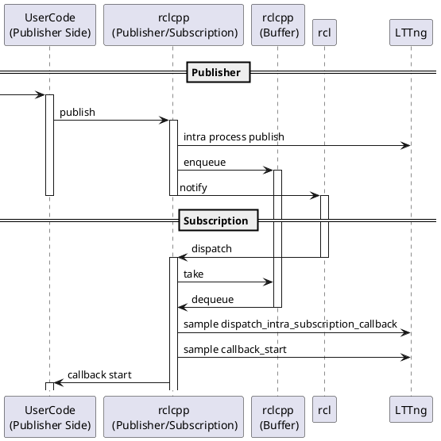
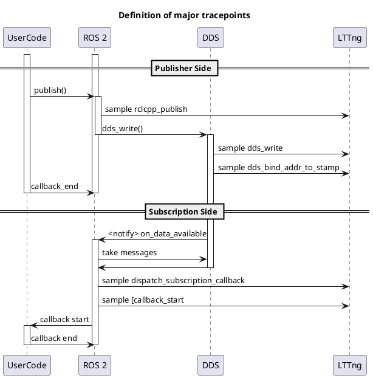

＃ コミュニケーション

通信レイテンシは、トピック メッセージがソース コールバックから次のコールバックまで移動するのにかかる時間を表します。

$$
l_{comm} = t_{sub} - t_{pub}
$$

<prettier-ignore-start>
!!! Info
        この定義では、通信遅延はコールバックのスケジューリングの影響を受け、DDS の通信遅延だけでなく、スケジューリングによる遅延も含まれます。
        たとえば、複数のコールバックが同時にディスパッチされる場合、通信遅延には他のコールバックの実行時間が含まれる可能性があります。
        スケジュールの詳細については、「[Event and latency_definitions | overview](../index.md#detailed-sequence)」を参照してください。
<prettier-ignore-end>

ROSの通信は、プロセス内通信とプロセス間通信をサブスクリプション側で行います。
ROSの通信は多対多の通信が可能なため、1回のパブリッシュでプロセス内通信とプロセス間通信の両方が行われる場合があります。
CARETでは、通信を1:1のペアに分割してレイテンシを計算します。

## プロセス内通信

関連するデータ フローのみに焦点を当てた簡略化されたシーケンス図を以下に示します。

`to_dataframe` API は、次の列を含むテーブルを返します。

| Column                   | Type        | Description             |
| ------------------------ | ----------- | ----------------------- |
| rclcpp_publish_timestamp | System time | Publish time in rclcpp. |
| callback_start_timestamp | System time | Callback start time     |

こちらも参照

- [Trace points | rclcpp_intra_publish](../trace_points/runtime_trace_points.md#ros2rclcpp_intra_publish)
- [Trace points | dispatch_intra_process_subscription_callback](../trace_points/runtime_trace_points.md#ros2dispatch_intra_process_subscription_callback)
- [Trace points | callback start](../trace_points/runtime_trace_points.md#ros2callback_start)
- [Trace points | message_construct](../trace_points/runtime_trace_points.md#ros2message_construct)
- [RuntimeDataProvider API](https://tier4.github.io/caret_analyze/latest/infra/#caret_analyze.infra.lttng.lttng.Lttng.compose_intra_proc_comm_records)

## プロセス間通信

関連するデータ フローのみに焦点を当てた簡略化されたシーケンス図を以下に示します。

`to_dataframe` API は、次の列を含むテーブルを返します。

| Column                   | Type        | Description             |
| ------------------------ | ----------- | ----------------------- |
| rclcpp_publish_timestamp | System time | Publish time in rclcpp. |
| rcl_publish_timestamp    | System time | Publish time in rcl.    |
| dds_write_timestamp      | System time | Publish time in rmw.    |
| callback_start_timestamp | System time | Callback start time.    |

こちらも参照

- [Trace points | message_construct](../trace_points/runtime_trace_points.md#ros2message_construct)
- [Trace points | rclcpp_publish](../trace_points/runtime_trace_points.md#ros2rclcpp_publish)
- [Trace points | rcl_publish](../trace_points/runtime_trace_points.md#ros2rcl_publish)
- [Trace points | dds_write](../trace_points/runtime_trace_points.md#ros2_caretdds_write)
- [Trace points | rclcpp_ring_buffer_enqueue](../trace_points/runtime_trace_points.md#ros2rclcpp_ring_buffer_enqueue)
- [Trace points | rclcpp_ring_buffer_dequeue](../trace_points/runtime_trace_points.md#ros2rclcpp_ring_buffer_dequeue)
- [Trace points | dds_bind_addr_to_addr](../trace_points/runtime_trace_points.md#ros2_caretdds_bind_addr_to_addr)
- [Trace points | dds_bind_addr_to_stamp](../trace_points/runtime_trace_points.md#ros2_caretdds_bind_addr_to_stamp)
- [Trace points | callback start](../trace_points/runtime_trace_points.md#ros2callback_start)
- [Trace points | dispatch_subscription_callback](../trace_points/runtime_trace_points.md#ros2dispatch_subscription_callback)
- [Trace points | rmw_take](../trace_points/runtime_trace_points.md#ros2rmw_take)
- [RuntimeDataProvider API](https://tier4.github.io/caret_analyze/latest/infra/#caret_analyze.infra.lttng.lttng.Lttng.compose_inter_proc_comm_records)
