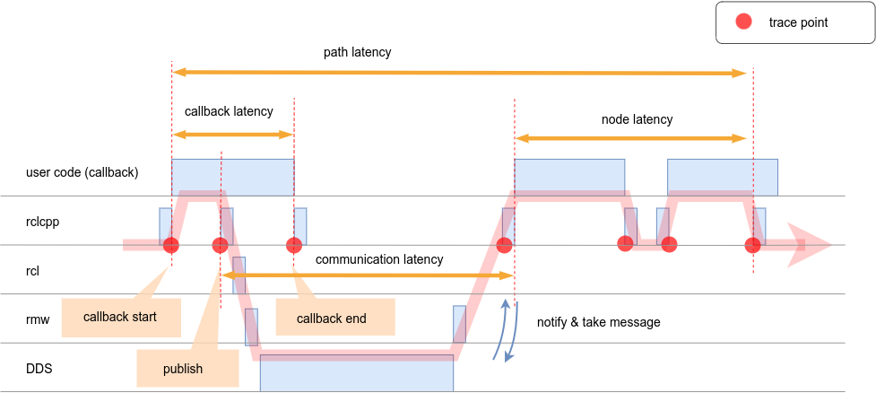
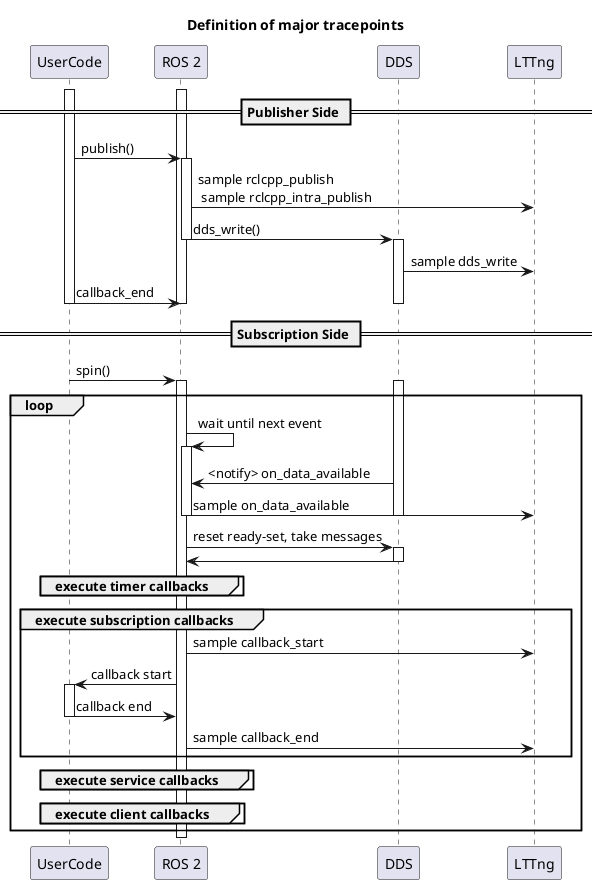

# レイテンシの定義

CARET は主に以下を測定します

- コールバック遅延
- 通信遅延
- ノードのレイテンシ
- パスの遅延

以下に示す簡略化されたシーケンス図は、各定義を示しています。

ここで、横軸は時間を表し、縦軸はレイヤーを表します。
赤い線はメッセージ フローを表します。
メッセージはサブスクリプション コールバックで受信され、処理されたデータが次のノードにパブリッシュされます。
このようにして、情報はセンサーノードからアクチュエーターノードに伝播されます。

CARET は、レイテンシ計算のためにイベントをサンプリングします。イベントの主な種類は以下の3つです。

- コールバック開始
- コールバック終了
- 公開

2 つのイベント間のタイムスタンプの差がレイテンシに対応します。

より詳細な定義については、を参照してください。

- [Callback](./callback.md)
- [Communication](./communication.md)
- [Node](./node.md)
- [Path](./path.md)

CARET は、Python オブジェクトを通じてイベントの時系列データを提供します。
時系列データは、to_dataframe API を持つ Python オブジェクトを使用して取得できます。
時系列データを取得できるすべてのオブジェクトを以下に示します。

|ターゲット |設定が必要ですか?|
|----------------------------------- |----------------------- |
|[Path](./path.md) |はい |
|[Node](./node.md) |はい |
|[Communication](./communication.md) |いいえ |
|[Callback](./callback.md) |いいえ |
|[Publisher](./publisher.md) |いいえ |
|[Subscription](./subscription.md) |いいえ |
|[Timer](./timer.md) |いいえ |

ここで、Path と Node は手動で定義する必要があります。
定義の設定の詳細については、[Configuration](../../configuration/index.md)を参照してください。

## 詳細なシーケンス

以下は、コールバックでのパブリッシュからサブスクリプション コールバックの実行までの、SingleThreadedExecutor の詳細なシーケンス図です。

ここで、各要素は以下のことを示します。

- UserCode はコールバックです
- ROS 2 は rclcpp、rcl、および rmw です
- DDS は FastDDS または CycloneDDS です
- LTTng はトレースポイントの出力先です。

サブスクリプションのスピン内で、実行可能コールバックが順番に実行されます。

このようにして、エグゼキュータはコールバックをスケジュールします。
実行可能なコールバックが複数ある場合、それらは順番に実行されるため、他のコールバックは待機する必要がある場合があります。

<prettier-ignore-start>
!!! Info
      スケジューラにはさまざまな提案があり、上記で提供される情報は最新のものではない可能性があります。
      システムのパフォーマンスは選択したスケジューラーによって異なることに注意してください。
<prettier-ignore-end>
