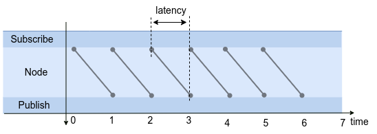
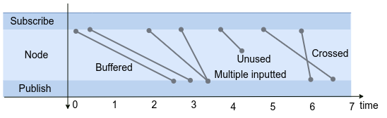

# ノード

ノード遅延とは、ノードでのメッセージ受信からメッセージ送信までの経過時間です。

$$
l_{ノード} = t_{転送} - t_{受信}
$$

ROS 2 のコンテキストでは、送信がパブリッシュに置き換えられ、受信がサブスクリプションに置き換えられるため、方程式は次の式に変換されます。

$$
l_{ノード} = t_{パブ} - t_{サブ}
$$

## メッセージコンテキスト

ノードはメッセージを受信し、処理して、後続のノードに発行し​​ます。
サブスクライブされたメッセージとパブリッシュされたメッセージの間の依存関係は、ノードの待ち時間を定義するために使用されます。
次のセクションでは、ノード レイテンシーの概念であるメッセージの依存関係 (メッセージ コンテキスト) について説明します。

たとえば、次のコールバックを考えてみましょう。

```c++
auto subsription_callback = [](&msg){
        msg_ = f(msg);
        pub.publish(msg_);
}
```

この場合、受信したメッセージはすぐに処理され、公開されます。
このときのメッセージの依存関係を時系列に記述すると以下のように表される。



ここでは、サブスクリプションからパブリッシュまでの経過時間をノード レイテンシーとして定義します。
このようにして、メッセージの依存関係を定義するときにノードの待ち時間を計算できます。

前の例では、ノードがサブスクライブされ、すぐに公開されるケースを示しました。
実際には、ノード内のデータ処理はアプリケーション開発者によって自由に定義されるため、メッセージ コンテキストは非常に複雑になる可能性があります。



複雑なメッセージ コンテキストの例を以下に説明します。

- たとえば、Buffered はバッファ遅延処理です。
・複数入力は移動平均処理などに使用します。ノードのレイテンシには複数の候補があります。
- 未使用は、公開されておらず、使用されていないメッセージです。これは、一種のメッセージ ドロップとして評価されます。
- クロスは、システム時間ではなくメッセージのタイムスタンプに基づいてメッセージが取得される場合に発生する可能性があります。

いずれの場合も、メッセージのコンテキストを自動的に判断することは困難です。

メッセージコンテキストは、設定に示すように、いくつかの場合に提供されます。
詳細については、「[Configuration](../../configuration/index.md)」を参照してください。

他の複雑なケースのカバー範囲を拡大するために、ユーザーがユーザー コードでメッセージの依存関係を記述できるメカニズムを検討しています。
[TILDE](../software_architecture/tilde.md) は、それを達成するための有力な候補の 1 つです。
