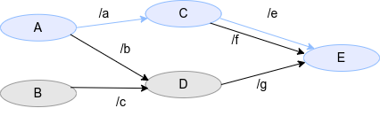

＃ パス

パスレイテンシは、あるパスに含まれるノードレイテンシと通信レイテンシの合計です。
パスは、相互に接続された複数のノードから構成されるデータの流れを表します。

$$
l_{パス} = \sum_{\in パス} l_{node} + \sum_{\in パス} l_{comm} \\
l_{node} = t_{pub} - t_{sub} \\
l_{comm} = t_{sub} - t_{pub} \\
$$

CARET では、パスは `[node_name]-[topic_name]-... -[topic_name]-[node_name]` として定義されます。
たとえば、次の場合、パス定義は `[A]-[/a]-[C]-[/e]-[E]` です。

<prettier-ignore-start>
!!! Info
    上記の定義では、レイテンシの開始時刻は最初のノードのパブリッシュであり、レイテンシの終了時刻は最後のノードのサブスクリプションです。
    実際のシステムを測定しようとする場合、実装に応じてさまざまな開始時間と終了時間を定義できることが望ましいです。
    たとえば、開始時刻はセンサー メッセージ内のスタンプ値の方が適切かもしれません。
    このようなより正確なレイテンシをサポートすることが現在の課題です。
<prettier-ignore-end>
