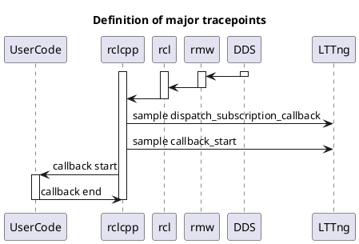
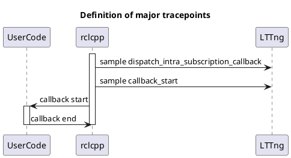

＃ サブスクリプション

トピックメッセージは、プロセス間通信またはプロセス内通信を介してサブスクリプションによって受信されます。
次に、`Subscription` オブジェクトには共通のデータフィールドがありますが、`source_timestamp` フィールドには異なる値が入力されます。

## プロセス間通信

関連するイベントのみに焦点を当てた簡略化されたシーケンス図を以下に示します。

`to_dataframe` API は、次の列を含むテーブルを返します。

| Column                   | Type           | Description                                            |
| ------------------------ | -------------- | ------------------------------------------------------ |
| callback_start_timestamp | System time    | Callback start time                                    |
| message_timestamp        | Message data   | Time of header.stamp. Zero when header is not defined. |
| source_timestamp         | Depends on DDS | Timestamp to used for binding with subscription.       |

こちらも参照

- [Subscription API](https://tier4.github.io/caret_analyze/latest/infra/#caret_analyze.infra.lttng.records_provider_lttng.RecordsProviderLttng.subscribe_records)
- [Trace points | dispatch_subscription_callback](../trace_points/runtime_trace_points.md#ros2dispatch_subscription_callback)
- [Trace points | rmw_take](../trace_points/runtime_trace_points.md#ros2rmw_take)
- [Trace points | callback_start](../trace_points/runtime_trace_points.md#ros2callback_start)

## プロセス内通信

`to_dataframe` API は、次の列を含むテーブルを返します。

| Column                   | Type                      | Description                                            |
| ------------------------ | ------------------------- | ------------------------------------------------------ |
| callback_start_timestamp | System time               | Callback start time                                    |
| message_timestamp        | Message data              | Time of header.stamp. Zero when header is not defined. |
| source_timestamp         | Depends on DDS (Optional) | NaN.                                                   |

こちらも参照

- [Subscription API](https://tier4.github.io/caret_analyze/latest/infra/#caret_analyze.infra.lttng.records_provider_lttng.RecordsProviderLttng.subscribe_records)
- [Trace points | rclcpp_ring_buffer_dequeue](../trace_points/runtime_trace_points.md#ros2rclcpp_ring_buffer_dequeue)
- [Trace points | dispatch_intra_process_subscription_callback](../trace_points/runtime_trace_points.md#ros2dispatch_intra_process_subscription_callback)
- [Trace points | callback_start](../trace_points/runtime_trace_points.md#ros2callback_start)
