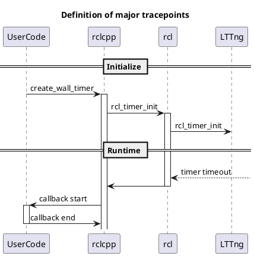

# タイマー

タイマーは、タイマー コールバックのタイムアウト時間と関連情報を提供します。

関連するイベントのみに焦点を当てた簡略化されたシーケンス図を以下に示します。

`to_dataframe` API は、次の列を含むテーブルを返します。

| Column                   | Type        | Description         |
| ------------------------ | ----------- | ------------------- |
| timer_event_timestamp    | System time | Timer timeout.      |
| callback_start_timestamp | System time | Callback start time |
| callback_end_timestamp   | System time | Callback end time   |

ここで、タイマーの起動時間は次のように計算されます。

$$
t_{タイムアウト} = t_{init} + n \times t_{期間}
$$

こちらも参照

- [Timer API](https://tier4.github.io/caret_analyze/latest/infra/#caret_analyze.infra.lttng.records_provider_lttng.RecordsProviderLttng.timer_records)
- [Trace point | callback_start](../trace_points/runtime_trace_points.md#ros2callback_start)
- [Trace point | callback_end](../trace_points/runtime_trace_points.md#ros2callback_end)
- [Trace point | rcl_timer_init](../trace_points/initialization_trace_points.md#ros2rcl_timer_init)
