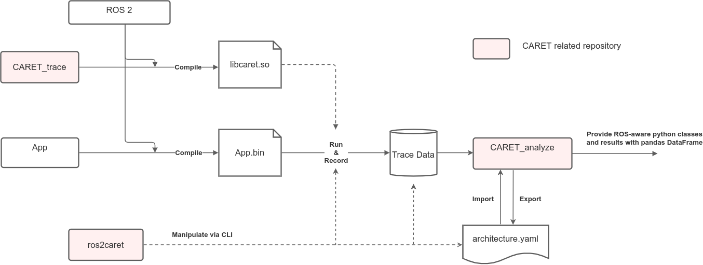

＃ デザイン

＃＃ 導入

設計の章では、アーキテクチャの概要、トレースポイントの定義、データの視覚化など、CARET の詳細について説明します。
トレースの流れと関連パッケージの概要を次の図に示します。

CARET は、ユーザーアプリケーション、ROS 2 および DDS に埋め込まれたトレースポイントからのイベント データ (メタデータやタイムスタンプを含む) を記録します。
イベントデータは、[CTF](https://diamon.org/ctf/) ベースのファイルのセットとしてダンプされます。ファイルのセットは、CARET のコンテキストでは「トレースデータ」と呼ばれます。

CARET はトレースデータをロードし、ユーザーがアプリケーションのパフォーマンスとボトルネックを理解できるようにグラフと統計に変換します。

この章では、以下に示す設計方針とポイントについて説明します。この章はヘビーユーザーまたは開発者向けに書かれているため、ライトユーザーのほとんどは退屈に感じるかもしれません。

- アーキテクチャとトレース ポイントに関する設計の概要
  1. [Software architecture](./software_architecture/index.md)
  2. [Event and latency definition](./event_and_latency_definitions/index.md)
  3. [Limits and constraints](./limits_and_constraints/index.md)

- [Recording](../recording/index.md)に関するデザイン
  1. [Runtime processing](./runtime_processing/index.md)
  2. [Tracepoints](./trace_points/index.md)

・「構成」に関するデザイン
  1. [Configuration](./configuration/index.md)

・「見える化」に関するデザイン
  1. [Processing trace data](./processing_trace_data/index.md)
  2. [Visualization](./visualizations/index.md)

実装の詳細に興味がある場合は、[caret_analyze API document](https://tier4.github.io/caret_analyze/) が役立つかもしれません。
