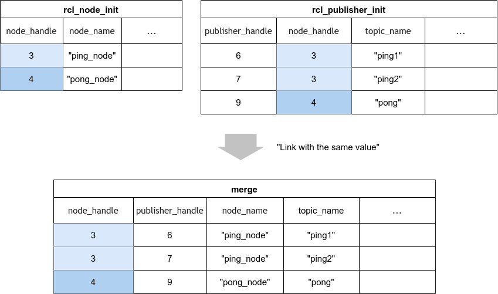
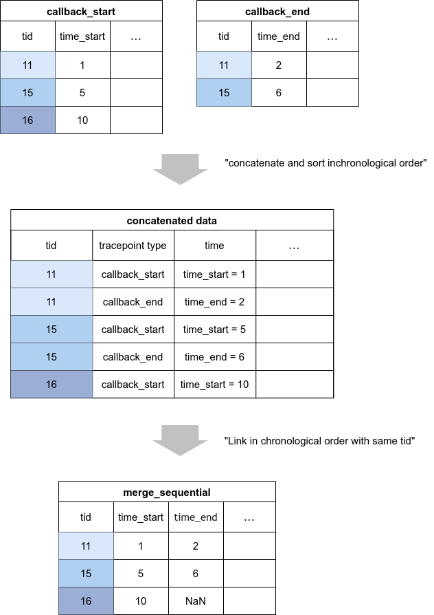
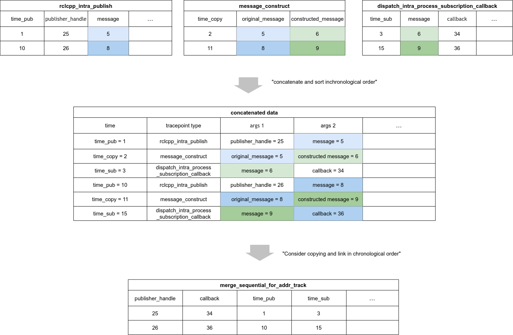

# レコードオブジェクト

CARET はユーザーにトレース データを提供します。
一般的な形式は、以下に示すようにメトリックごとのテーブルです。

|コールバック開始タイムスタンプ |コールバック終了タイムスタンプ |
|------------------------ |---------------------- |
|0 |0.1 |
|1 |1.1 |
|2 |2.1 |
|... |... |

このテーブルは、レイテンシや周期などを計算するために参照されます ([Records Service](./records_service.md) を参照)。
最も原始的な形式は、対応するトレースポイントによって取得されるイベントごとのテーブルです。
複数のイベント テーブルを結合すると、メトリクス用の新しいテーブルが作成されます。
CARET では、単純なテーブルのマージに加えて、レイテンシー計算のためのマージ方法を独自に定義したクラスを定義します。

このセクションでは、レコード オブジェクトによって提供される主な API について説明します。

- マージ
- マージシーケンシャル
- addr_track のマージシーケンシャル
- to_dataframe

## マージ

一般的なテーブルの内部結合と外部結合です。
特に、アドレスのみでバインドできる初期化関連のトレース データを結合するために使用されます。

こちらも参照

- [API:merge](https://tier4.github.io/caret_analyze/latest/record/#caret_analyze.record.interface.RecordsInterface.merge)

## マージシーケンシャル

これは時系列のマージです。
特にスレッドによる順次処理をマージするために使用されます。

CARET は主にこのマージを実行し、レイテンシーを計算します。

こちらも参照

- [API:merge](https://tier4.github.io/caret_analyze/latest/record/#caret_analyze.record.interface.RecordsInterface.merge_sequential)
- [Callback Latency Definition](../event_and_latency_definitions/callback.md)

## merge_sequential_for_addr_track

このマージは、アドレスに基づいてバインドが行われ、プロセスの途中でコピーが発生する場合に使用されます。

こちらも参照

- [API:merge_sequential_for_addr_track](https://tier4.github.io/caret_analyze/latest/record/#caret_analyze.record.interface.RecordsInterface.merge_sequential_for_addr_track)

<prettier-ignore-start>
!!!warning
    このマージは遅く、caret-rclcpp を使用していないノードが公開されると不整合が発生します。
    可能な限り、merge_sequential で十分になるようにトレース ポイントを設計する必要があります。
<prettier-ignore-end>

## to_dataframe

pandas.DataFrame に変換する関数。
これは、開発者による独自の視覚化と評価に特に役立ちます。
