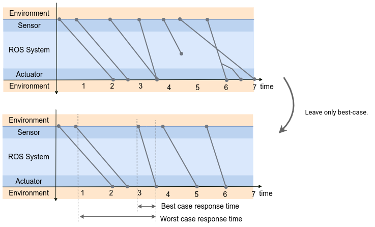

# 記録サービス

Records オブジェクトは、以下に示すように、メッセージ フローなどの時系列データをテーブルで保持します。

|開始タイムスタンプ |... |終了タイムスタンプ |
|--------------- |--- |------------- |
|0.0 |... |0.1 |
|1.0 |... |1.1 |
| 2.0 | ... | NaN |
|3.0 |... |2.1 |
|... |... |... |

開始タイムスタンプ列には、開始時点のシステム時間が含まれます。
終了タイムスタンプ列には、終了点のシステム時間が含まれます。
両方の列はシステム時刻を示し、start に対応する値がない場合、値は NaN になります。

中間列については、開始点と終了点の間の中間点の時間を表します。

このテーブル表現は、コールバック、ノード、パスなどのさまざまな測定対象に使用できます。

テーブルの行は、メッセージ フロー図の線として視覚化されます。

上記のテーブルは `Records` オブジェクトによって格納されます。

- [Records](./records.md)

以下はRecordsオブジェクトを使用した処理です。

- [Period](./records_service.md#period)
- [Frequency](./records_service.md#frequency)
- [Latency](./records_service.md#latency)
- [Response time](./records_service.md#response-time)

こちらも参照

- [Event and latency definition](../event_and_latency_definitions/index.md)

こちらも参照

- [Records](./records.md)

＃＃ 期間

期間は、周期的なイベントが 2 回発生するまでの経過時間として定義されるメトリクスです。
同じ列上の 2 つの隣接するタイムスタンプの差は、期間として定義されます。

$$
    period_n = t_{n} -t_{n-1}
$$

＃＃＃ 例

入力

|開始タイムスタンプ |
|--------------- |
|0.0 |
|1.0 |
|2.0 |
|3.0 |
|... |

出力

|タイムスタンプ |期間 |
|--------- |------ |
|0.0 |1.0 |
|1.0 |1.0 |
|2.0 |1.0 |
|... |... |

こちらも参照

- [API Reference | Period](https://tier4.github.io/caret_analyze/latest/record/#caret_analyze.record.Period)

＃＃ 頻度

頻度は、1 秒間に発生するイベントの数として定義されます。

＃＃＃ 例

入力

|開始タイムスタンプ |
|--------------- |
|0.0 |
|0.1 |
|0.5 |
|1.2 |
|1.3 |
|2.3 |
|... |

出力

|タイムスタンプ |期間 |
|--------- |------ |
|0.0 |3.0 |
|1.0 |2.0 |
|... |... |

## レイテンシ

レイテンシは、前のイベントから後のイベントまでの時間の長さです。これは、同じ行の前のタイムスタンプとその後のタイムスタンプとの差として定義されます。

$$
latency_n = t^{end}_{n} - t^{start}_{n}
$$

＃＃＃ 例

入力

|開始タイムスタンプ |終了タイムスタンプ |
|--------------- |------------- |
|0.0 |0.1 |
|1.0 |1.1 |
| 2.0 | NaN |
|3.0 |3.1 |
|... |... |

出力

|開始タイムスタンプ |レイテンシ |
|--------------- |------- |
|0.0 |0.1 |
|1.0 |0.1 |
|3.0 |0.1 |
|... |... |

## 応答時間

応答時間は、システムが入力に応答するまでにかかる時間です。

上に示したように、テーブルを構築すればレイテンシーを計算できます。
レイテンシーは、入力から出力までの遅延として定義されます。
この計算は非常に単純ですが、応答の評価には使用されません。
複数の出力が 1 つの入力に依存する場合、レイテンシーは応答時間とはみなされません。
さらに、たとえば、センサーが 10 Hz で駆動される場合、最大 100 ms の遅延を考慮する必要があります。

CARET は、最良の場合の応答時間と最悪の場合の応答時間を提供します。
前者は、入力から対応する初期出力までのレイテンシーにほぼ等しくなります。
CARET は後者を提供します。これは、時間が起動するまでのレイテンシも考慮に入れているためです。
たとえば、この遅延は、10 Hz で動作するセンサーが最大 100 ms の遅延を受けることに相当します。

＃＃＃ 例

入力

|開始タイムスタンプ |終了タイムスタンプ |
|--------------- |------------- |
|0.0 |0.1 |
|1.0 |1.1 |
| 2.0 | NaN |
|3.0 |3.2 |
|4.0 |4.3 |
|... |... |

中級
開始タイムスタンプ [0.0, 4.0] の間隔が終了タイムスタンプにマップされるときの中間データを作成します。

|開始タイムスタンプ |終了タイムスタンプ |
|--------------- |------------- |
|[0.0、1.0) |1.1 |
|[1.0、3.0) |3.2 |
|[3.0、4.0) |4.3 |

出力

|開始タイムスタンプ |最良の場合の応答時間 |最悪の場合の応答時間 |
|--------------- |----------------------- |------------------------ |
|1.0 |0.1 (1.1 - 1.0) |1.1 (1.1 - 0.0) |
|3.0 |0.2 (3.2 - 3.0) |2.3 (3.2 - 1.0) |
|... |... |... |

後でリストする面倒なケースを除き、最良の場合の応答時間はレイテンシーと同じであることに注意してください。

最悪の場合の応答時間も、落下の場合の応答時間としてカウントされます。

### 応答時間を視覚化する

上に示した疑似 2 つのメッセージ フロー図のうち、上の図はレイテンシーを示し、下の図は応答時間を説明します。
上図には以下のような面倒なケースが含まれています。

- 複数の入力から単一の出力に対して複数のレイテンシが定義されている場合
- メッセージのドロップ
- 交差点
- 分岐

これらの一部は、レイテンシに関して悲観的に大きくなる可能性があります。

上の図ではテーブルを次のように説明しています。

|開始タイムスタンプ |終了タイムスタンプ |
|--------------- |------------- |
|0.0 |2.0 |
|0.5 |2.5 |
|2.0 |3.5 |
|3.0 |3.5 |
|4.0 |5.0 |
|4.5 |7.0 |
|5.5 |6.0 |
|5.5 |6.5 |

下図のように最良のケースフローのみを抽出した後、
最良のケースはフローのレイテンシとして計算され、ワー​​ストケースはレイテンシが前の入力から出力までの遅延とみなされます。

これらの定義に従って、応答時間は次のように計算されます。

|開始タイムスタンプ |最小応答時間 |最大応答時間 |
|--------------- |----------------- |----------------- |
|0.0 |2.0 |2.5 |
|0.5 |0.5 |3.0 |
|3.0 |1.0 |2.0 |
|4.0 |0.5 |2.0 |

こちらも参照

- [FAQ | How response time is calculated?](../../faq/faq.md#how-response-time-is-calculated)
