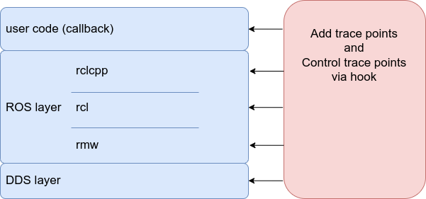

# フック

関数フックは、CARET によって実行される重要な手法の 1 つです。
このセクションでは、CARET に導入された関数フックについて説明します。

こちらも参照

- [caret_trace](../software_architecture/caret_trace.md)

## フックの利点

ROS 2 は、RMW のおかげで DDS とは別に開発されています。
一方、各実装は異なる目的のために開発される可能性があるため、DDS を含むすべてのレイヤーの一貫した評価を達成することが困難になります。
CARET はフックによってこれらのレイヤーを処理し、トレース ポイントを一貫して追加および管理します。

こちらも参照

- [Tracepoints definition](../trace_points/index.md)

<prettier-ignore-start>
!!!Info
    可能であれば、ユーザー用のフックではなく、トレースポイントを組み込みとして追加することをお勧めします。
    ただし、CARET の優先事項は、トレース ポイントを徐々に追加することではなく、現在のバージョンの ROS で実行されているソフトウェアを評価することです。
    このため、ユーザーが柔軟にトレースポイントを追加できる関数フックを採用しました。
<prettier-ignore-end>

<prettier-ignore-start>
!!!Info
    The advantage of being able to handle all layers across the board is not well utilized in the current CARET.
    将来的には、スレッド ローカル メモリを使用してトレース ポイントを削減する予定です。
<prettier-ignore-end>

## LD_PRELOAD

### LD_PRELOAD の利点

LD_PRELOAD は、関数が API として外部に公開されていない場合でもフックできます。

ROS 層に組み込まれているトレース ポイント自体もフックすることができます。
これにより、トレースのフィルタリングが有効になります。

eBPF を使用してフックすることを思いつくかもしれませんが、eBPF ではユーザー空間からカーネル空間へのコンテキストの切り替えが必要です。
LD_PRELOAD によるフックはユーザー空間で完了できるため、オーバーヘッドが削減されます。

こちらも参照

- [Tracepoint filtering](./tracepoint_filtering.md)

### LD_PRELOAD の制限

LD_PRELOAD でフックできない、またはフックするのが難しい場合があります。

- cppテンプレートによるシンボルの多い関数
- インラインコードとして展開される関数のフック
- ヘッダーに実装された関数のフック

具体的には、プロセス内パブリッシュを LD_PRELOAD でフックすることはできません。
CARETでは、フォークされたrclcppにプロセス内通信用のトレースポイントが追加されます。
