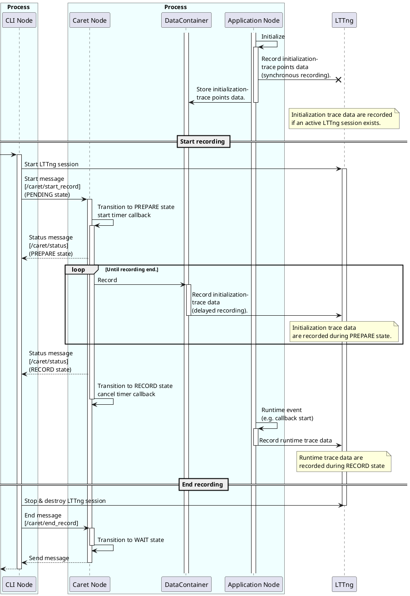
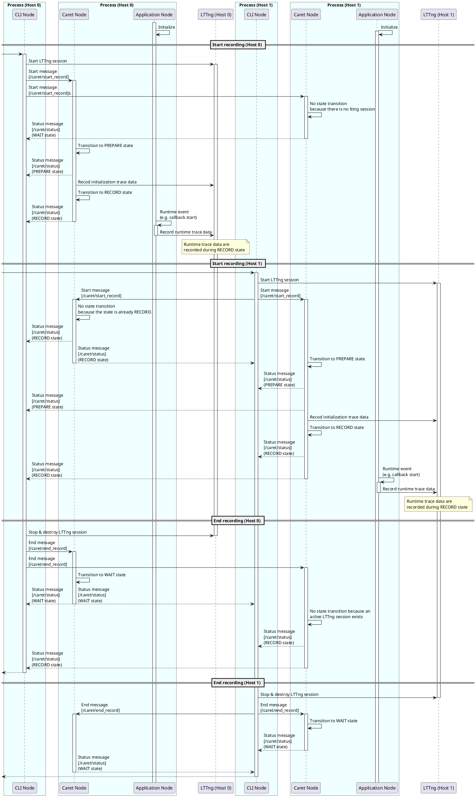

# Runtime recording

[Tracepoint section](../trace_points/index.md) で説明したように、CARET は初期化時にメタ情報を記録し、実行時にトレースポイント データを可能な限り削減します。
これにより、実行時のオーバーヘッドが低くなりますが、メタ情報を含む recording には、アプリケーションを実行する前に LTTng セッションが必要です。

CARET では、イベントのメタ情報とタイムスタンプが含まれる一連の記録データが必要です。
ユーザーがいつでも好きなときにセッションを開始できるようにするため、recording セッションの開始時に、CARET はメタ情報をディスクに保存します。recording セッションを停止して再起動するために、CARET はターゲット アプリケーションが終了するまでメモリ上にメタ情報を保持します。

このセクションでは、ランタイム recording 機能の詳細について説明します。

以下も参照してください。

- [Software architecture | caret_trace](../software_architecture/caret_trace.md)

## 基本的な考え方

Runtime recording は、初期化情報をメモリ上に保持し、recording セッションの開始後にトレース データに保存する機能です。これにより、ユーザーはいつでも recording セッションを開始できるようになります。

この機能では、各トレースポイントには次の 3 つの状態があります。

- WAIT状態
  - 実行中のアプリケーションに関する情報を取得し、トレース データをメモリに保存します。
- PREPARE状態
  - 保存されたトレース データを LTTng トレースポイント (遅延 recording) として記録します。
- RECORD状態
  - 実行時トレース データを LTTng トレース ポイント (同期 recording) として記録します。

トレース ノードという名前の専用ノードは、状態を管理するために ROS 2 プロセスごとに実行されます。
トレース ノードは、通常のノードのスレッドとともに専用スレッドで実行されます。
アプリケーションの起動時に作成されます。

<prettier-ignore-start>
!!! Notice
    トレース ノードは、関数フックによって作成されたスレッド上で実行されます。このスレッドは、ROS 2 プロセスが `rclcpp` で実装されていない場合でも作成されます。
    ROS 2 プロセスが `rclpy` で実装されている場合、トレース ノード スレッドが作成され、状態も制御されます。トレース ノードは Python ベースのノードで実行されますが、ノードの recording イベントは正しく実行されません。初期化トレースポイントのみが記録されます。
    Python は Global Interpreter Lock (GIL) メカニズムを提供しますが、トレース ノードは GIL によってブロックされない非同期スレッド上で実行されます。
<prettier-ignore-end>

代表的な使用例を以下に示します。

```bash
# Run a node at Terminal 0 first.
ros2 run pkg node
```

```bash
# Execute "record" command with Termial 1 after node startup.
ros2 caret record
```

以下に状態遷移を示します。

```plantuml
concise "Terminal 0" as User0
concise "Terminal 1" as User1
concise "trace node state" as Hook
concise "LTTng session" as Lttng

@0
User0 is "Idle"
User1 is "Idle"
Hook is "Idle"
Lttng is "Idle"

@2
User0 is "ros2 run pkg node"
Hook is WAIT : \nStore initialization \ntracepoints into memory\n.
User0 -> Hook

@6
User1 is "ros2 caret record"
Hook is PREPARE : Record stored \ninitialization tracepoints
User1 -> Hook : Start recording \n[ /caret/start_record ]\n\n
User1 -> Lttng
Lttng is "Active"

@10
Hook is RECORD : Record initialization \nand runtime tracepoints
Hook -> User1 : Notify state transition \n[ /caret/status ]\n

@15
User1 is "Idle"
Hook is WAIT
User1 -> Hook : End recording \n[ /caret/end_record ]\n\n
User1 -> Lttng
Lttng is "Destroyed"
```

詳細は[Sequence](#sequence)に記載されているシーケンス図を参照してください。

トレースノードには、通常の ROS 2 ノードだけでなく、トピックベースのインターフェイスもあります。
トピックメッセージは、トレースノードから状態を取得したり、トレースノードの状態を変更したりするために使用されます。

また、従来の使用方法との互換性を維持するために、
CARET は、セッション開始時にメタ情報と実行時イベントを事前に記録できます。

```plantuml
concise "Terminal 0" as User0
concise "trace node state" as Hook
concise "Terminal 1" as User2
concise "LTTng" as Lttng

@0
User0 is ""
User2 is ""
Hook is ""
Lttng is "idle"

@3
User2 is "ros2 caret trace"
User2 -> Lttng : Start session\n
Lttng is "Active"

@5
User0 is "launch"
Hook is RECORD : Record initialization and runtime tracepoints
User0 -> Hook


@15
User2 is ""
User2 -> Lttng : Destroy session\n
Lttng is "Destroyed"

```

メタ情報は LTTng セッションごとに記録されることに注意してください。

次の状態図は、3 つの状態のステート マシンを示しています。

```plantuml
[*] --> RECORD: An active lttng session exists
[*] --> WAIT: No active lttng session exists
WAIT : Stores initialization trace data in memory
PREPARE : Record initialization trace data with LTTng
WAIT --> PREPARE :Start recording

RECORD --> WAIT : End recording
PREPARE --> RECORD : Finished recording stored initialization trace data
RECORD : Record initialization and runtime trace data with LTTng
```

ステートマシンの詳細については、[Status](#state-definition) を参照してください。

## マルチホストシステム

マルチホストシステムにおける代表的な使用例を以下に示します。

```bash
# Run a node at Terminal 0-0 on Host 0.
ros2 run pkg0 node0
```

```bash
# Run a node at Terminal 1-0 on Host 1.
ros2 run pkg1 node1
```

```bash
# Execute "record" command with Termial 0-1 on Host 0.
ros2 caret record
```

```bash
# Execute "record" command with Termial 1-1 on Host 1.
ros2 caret record
```

以下に状態遷移を示します。

```plantuml
concise "Terminal 0-0 on Host 0" as User0_0
concise "Terminal 0-1 on Host 0" as User0_1
concise "Terminal 1-0 on Host 1" as User1_0
concise "Terminal 1-1 on Host 1" as User1_1
concise "trace node state on Host 0" as Hook0
concise "LTTng session on Host 0" as Lttng0
concise "trace node state on Host 1" as Hook1
concise "LTTng session on Host 1" as Lttng1

@0
User0_0 is "Idle"
User0_1 is "Idle"
Hook0 is "Idle"
Lttng0 is "Idle"
User1_0 is "Idle"
User1_1 is "Idle"
Hook1 is "Idle"
Lttng1 is "Idle"

@2
User0_0 is "ros2 run pkg0 node0"
Hook0 is WAIT
User0_0 -> Hook0

@3
User1_0 is "ros2 run pkg1 node1"
Hook1 is WAIT
User1_0 -> Hook1

@5
User0_1 is "ros2 caret record"
Hook0 is PREPARE
User0_1 -> Hook0 : Start recording \n[ /caret/start_record ]\n\n\n\n
User0_1 -> Lttng0
Lttng0 is "Active"
User0_1 -> Hook1

@7
Hook0 is RECORD
Hook0 -> User0_1 : Notify state transition \n[ /caret/status ]

@9
User1_1 is "ros2 caret record"
Hook1 is PREPARE
User1_1 -> Hook1 : Start recording \n[ /caret/start_record ]\n\n\n\n
User1_1 -> Lttng1
Lttng1 is "Active"
User1_1 -> Hook0

@11
Hook1 is RECORD
Hook1 -> User1_1
Hook1 -> User0_1 : Notify state transition \n[ /caret/status ]\n

@16
User0_1 is "Idle"
Hook0 is WAIT
User0_1 -> Hook0 : End recording \n[ /caret/end_record ]\n\n\n\n\n\n
User0_1 -> Lttng0
User0_1 -> Hook1
Lttng0 is "Destroyed"

@17
User1_1 is "Idle"
Hook1 is WAIT
User1_1 -> Hook1 : End recording \n[ /caret/end_record ]\n\n\n\n\n\n
User1_1 -> Lttng1
User1_1 -> Hook0
Lttng1 is "Destroyed"
```

「START recording」 と 「STOP recording」 はトピック メッセージであるため、ホストに関係なくすべてのトレース ノードに送信されることに注意してください。他ホストからのメッセージによる状態遷移を防ぐため、トレースノードは以下のようにメッセージを無視します。

- アクティブな LTTng セッションが存在しない場合は、「Start recording」を無視します。
・「開始recording」の状態がWAITでない場合は無視してください。
- アクティブな LTTng セッションが存在する場合、「End recording」を無視します。

＃＃ トピック

Runtime recording は次のトピックメッセージを使用します。

|トピック名 |メッセージタイプ |役割 |
|--------------------- |------------ |----------------------------------------------- |
|`/caret/start_record` |Start.msg |recording を開始します。PREPARE 状態に遷移します。|
|`/caret/end_record` |Stop
.msg |recording を終了します。WAIT状態に遷移します。|
|`/caret/status` |Status.msg |現在の recording 状態を同期します。|

### Start.msg

```cpp
uint32 recording_frequency 100
string ignore_nodes  # reserved
string ignore_topics # reserved
string select_nodes  # reserved
string select_topics # reserved
```

CARET は、メタ情報のセットを一度に保存するのではなく、LTTng リング バッファに 1 つずつ記録します。
CARET は、メタ情報を記録する速度を制御するパラメータ `recording_frequency` を提供します。
`recording_frequency` は、各プロセスがメタ情報を記録する頻度です。1 秒あたり何セットのメタ情報をリング バッファに保存するかを決定します。
頻度が高いほど、メタ情報 recording を完成させるのにかかる時間は短くなりますが、トレーサが破棄される可能性が高くなります。

`ignore_nodes` `ignore_topics` `select_nodes`、および `select_topics` は、将来の実装では使用されないフィールドです。
これらは、CLI からの測定開始時に [tracepoint filtering](./tracepoint_filtering.md) を設定するための予約フィールドです。

<prettier-ignore-start>
!!!Info
    トレーサの破棄を回避するもう 1 つの方法は、[blocking mode](https://lttng.org/blog/2017/11/22/lttng-ust-blocking-mode/) を使用してメタ情報を書き込むことです。LTTng は、選択したイベントにブロッキング モードを適用する機能を果たし、選択したイベントはディスクに正確に書き込まれます。ブロッキングモードでは、データ損失の発生が軽減されます。現時点では、実装への影響範囲がブロッキング モードよりも小さいため、データ損失を軽減するために `recording_frequency` が導入されています。
<prettier-ignore-end>

### Status.msg

```cpp
int8 UNINITIALIZED=0
int8 WAIT=1
int8 PREPARE=2
int8 RECORD=3

string caret_node_name
int8 status
string[] node_names # reserved
int64 pid # reserved
```

`caret_node_name`フィールドにはトレースノード名が付与されます。

`status` は、WAIT、PREPARE、または RECORD ステータスです。

`node_names` フィールドは現在未使用ですが、将来の機能で利用される予定です。
これは、トレース ノードによって管理されるノード名のリストを表す予約フィールドです。

`pid` フィールドも未実装の機能に使用されるため、未使用です。
これはプロセス ID を表す予約フィールドです。

### Stop.msg

```cpp
(Empty)
```

Endトピックは通知用なので内容は空です。

## 状態の定義

詳細な状態遷移を以下に示します。

```plantuml
[*] --> WAIT: No active lttng session exists
[*] --> RECORD: An active lttng session exists
WAIT : Stores initialization trace data in memory
WAIT --> PREPARE : [/caret/start_record] with \nactive LTTng session

PREPARE : Record initialization trace data with LTTng
PREPARE --> RECORD : Finished recording stored initialization trace data
PREPARE -[dotted]-> WAIT : [/caret/end_record] without \nactive LTTng session

RECORD : Record initialization and runtime trace data with LTTng
RECORD --> WAIT : [/caret/end_record] without \nactive LTTng session
```

### WAIT

|アイテム |説明 |
|---------------------------------- |--------------------------------------------------------------------------------------------------------------------------------------------- |
| WAIT に入る移行条件|- アクティブな LTTng セッションがない状態でアプリケーションを開始します。<br> - アクティブな LTTng セッションが存在しない場合に、`/caret/end_record` トピックからメッセージを受信します。|
|終了の移行条件 |- アクティブな LTTng セッションが存在する場合、`/caret/start_record` トピックからメッセージを受信します。|
|初期化トレースポイント |- メモリに保存します。<br> - LTTng トレースポイントとして記録します (同期 recording)。|
|実行時トレース データ |- 破棄。|

### PREPARE

|アイテム |説明 |
|---------------------------------- |------------------------------------------------------------------------------------------------------------------------------------------------------------ |
|PREPARE に入る移行条件|- 現在の状態が WAIT で、アクティブな LTTng セッションが存在する場合、`/caret/start_record` トピックからメッセージを受信します。|
|終了の移行条件 |- アクティブな LTTng セッションが存在しない場合に、`/caret/end_record` トピックからメッセージを受信します。<br> - recording に保存された初期化トレース データを終了します。|
|初期化トレースデータ |- LTTng トレースポイント (同期 recording) として記録します。<br> - トレース ノードから固定頻度で保存されたデータを LTTng トレースポイントとして記録します (遅延 recording)。|
|実行時トレース データ |- 初期化トレースデータの破棄を防ぐために破棄します。|

LTTngのリングバッファへの初期化トレースデータの格納速度は、`Start.msg`の`recording_frequency`で調整されます。

<prettier-ignore-start>
!!!Info
    初期化トレース データは、すべての状態で同期して記録されます。PREPARE 状態では、トレースノードからも同じデータが遅れて記録されます。
    このように、LTTng セッションとアプリケーションが逆の順序で開始された場合でも、初期化トレース データは可能な限り記録されます。
    特に PREPARE 状態では、トレース ノードからの同期 recording と遅延 recording の 2 種類の recording があります。
    したがって、同じデータが重複して格納される可能性があります。重複データはcaret_analyze側で処理されます。
<prettier-ignore-end>

### RECORD

|アイテム |説明 |
|---------------------------------- |------------------------------------------------------------------------------------------------------ |
|RECORD に入る移行条件|- アクティブな LTTng セッションでアプリケーションを開始します。<br> - recording に保存された初期化トレース データを終了します。|
|終了の移行条件 |- アクティブな LTTng セッションが存在しない場合に、`/caret/end_record` トピックからメッセージを受信します。|
|初期化トレースデータ |- LTTng トレースポイント (同期 recording) として記録します。|
|実行時トレース データ |- LTTng トレースポイント (同期 recording) として記録します。|

## シーケンス

シーケンス図の詳細を以下に示します。

```bash
# Run a node at Terminal 0 first.
ros2 run pkg node
```

```bash
# Execute "record" command with Termial 1 after node startup.
ros2 caret record
```



## シーケンス（マルチホストシステム）

マルチホストシステムにおけるシーケンス図の詳細を以下に示します。

```bash
# Run a node at Terminal 0-0 on Host 0.
ros2 run pkg0 node0
```

```bash
# Run a node at Terminal 1-0 on Host 1.
ros2 run pkg1 node1
```

```bash
# Execute "record" command with Termial 0-1 on Host 0.
ros2 caret record
```

```bash
# Execute "record" command with Termial 1-1 on Host 1.
ros2 caret record
```



## トレースポイント

ランタイム recording 機能により、ターゲット アプリケーションの起動後の recording のアクティブ化をサポートする recording が遅延しました。イベントが記録されるときにタイムスタンプが付与されるため、初期化トレース ポイントのタイムスタンプは、トレース ポイントが呼び出された実際の時刻とは異なります。
`caret_analyze` が提供する解析スクリプトは初期化トレースポイントの呼び出し時間を利用するため不便です。たとえば、タイマー コールバックが呼び出される予想時間は、初期化時間と所定の期間から計算されます。recording 時間だけを指定した場合、予想時間を正しく計算できません。

この不都合に対処するために、すべての初期化トレース ポイントには、ターゲット アプリケーションの起動中に呼び出されたときにそれぞれタイムスタンプが与えられます。

```cpp
[ros2:rcl_timer_init] (-> [ros2_caret:rcl_timer_init])

(context)
time (time that a lttng tracepoint is called.)
...

(tracepoint data)
void * timer_handle
int64_t period
int64_t init_timestamp (timestamp given when trace point is called during )
```

`init_timestamp` は、初期化トレース ポイントが呼び出されたときの元の時刻を持つ追加の引数です。
`ros2:` のプレフィックスは `ros2_tracing` 用であるため、`ros2_caret` は CARET のトレース ポイントを表すプレフィックスです。
