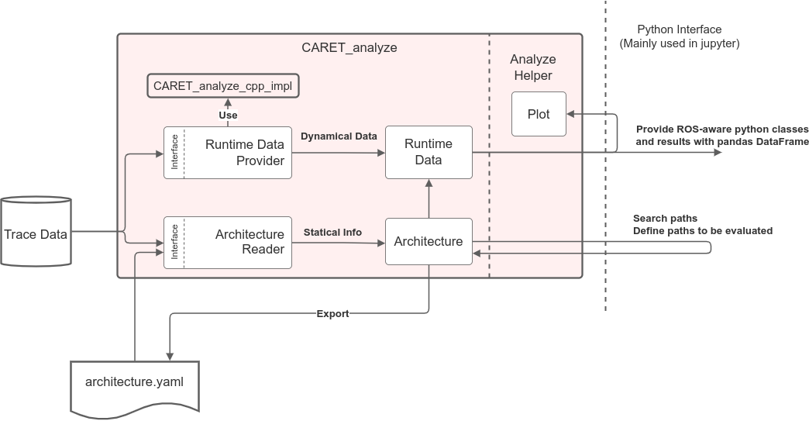

# caret_analyze

`caret_analyze` は、ユーザーがトレース データとアーキテクチャ オブジェクトをロードするのに役立ち、構成と評価用の Python API を提供するパッケージのセットです。

各クラスの定義については、[CARET analyze API document](https://tier4.github.io/caret_analyze/)を参照してください。

`caret_analyze`のデータの流れを次の図に示します。



トレース データのセットは、メモリにロードされた後、2 つのセクションに分割されます。アーキテクチャ オブジェクトとランタイム データ。

アーキテクチャ オブジェクトには、ターゲット アプリケーションの構造の記述が含まれます。このオブジェクトは、対象アプリケーションの構造やコンポーネントの名前を変更しない限り、再利用できます。

ランタイム データ オブジェクトには、ターゲット アプリケーションの実行中にサンプリングされたデータが含まれます。サンプリングされたデータには、トレースポイントから取得されたタイムスタンプが含まれており、その値は実行ごとに異なります。
実行時データはアーキテクチャと結合され、評価が容易な Python-API 経由で開発者に提供されます。

アーキテクチャ オブジェクトとランタイム データは、それぞれの Python クラスからインスタンス化されます。
クラスの構造は、エグゼキュータ、ノード、コールバック関数、トピック メッセージで構成される ROS アプリケーションの構造に基づいて設計されています。ROS ベースの構造により、CARET の API は ROS ユーザーにとって使いやすいものになっています。

`caret_analyze` は複数の Python パッケージで構成されています。
各Pythonのパッケージは以下の通りです。

|Python パッケージ |役割 |
|--------------- |-------------------------------------- |
|`architecture` |アーキテクチャ オブジェクトをロードして構成する |
|`runtime` |実行データを提供する |
|`value_objects` |値オブジェクトのコレクション |
|`plot` |視覚化ヘルパー |
|`records` |記録の実装 |
|`common` |共通関数またはヘルパー関数 |
|`infra` |外部ファイルをインポートする |

各パッケージは次の図に示すように相互関係を持っています。

```plantuml
package architecture {
  component Architecture
}
package runtime {
  component Application
}
package infra {
  component Lttng
  component Yaml
}
package value_objects {
  component NodeStructValue
  component NodeValue
}
package records {
  component Records
  component RecordsCppImpl
}

package plot {
  component Plot
}

interface "Runtime Data Provider" as Idata_provider
interface "Architecture Reader" as Iarchitecture_reader

interface "RecordsInterface" as Irecords


Lttng -- Idata_provider
Lttng -- Iarchitecture_reader
Yaml -- Iarchitecture_reader
Irecords -up- Records
Irecords -up- RecordsCppImpl
Application o-left- Architecture
Iarchitecture_reader <.down. Architecture : use
Idata_provider <.down. Application : use
Application <.. Plot : use
NodeValue <.. infra
architecture o-- NodeStructValue
Irecords <.. infra : use
```

アーキテクチャ オブジェクトは、[configuration chapter](../../configuration/index.md) で説明されているように、ノード間パスを検索し、ノード内データ パスを定義するための API を提供します。アーキテクチャ オブジェクトは、「アーキテクチャ ファイル」と呼ばれる YAML ベースのファイルとして保存された後、再利用可能になります。

ランタイム データは、コールバック レイテンシや通信を含む `pandas.DataFrame` ベースのオブジェクトを取得するための API を提供します。ユーザーは、アプリケーションの時間的側面を視覚化して、期待どおりに分析できます。視覚化のための API は、トレース データを視覚化する主な役割を果たす `caret_analyze` によっても提供されます。

次のセクションでは、各パッケージについて詳しく説明します。

## `architecture`

`architecture` の目的は、視覚化のための静的情報を定義することです。

`architecture` パッケージは、アーキテクチャ オブジェクトを具体化するクラスを提供します。アーキテクチャ オブジェクトには 1 つ以上のサブコンポーネントがあります。
コンポーネントにはいくつかの種類があります。エグゼキュータ、ノード、コールバック、トピック。
CARET は、各タイプのコンポーネントにクラスを提供し、それらを `architecture` パッケージで管理します。

`architecture` クラスで表されるターゲット アプリケーションには、いくつかのサブコンポーネントがあります。`architecture` ベースのオブジェクトには、いくつかのタイプのサブコンポーネントもあります。

<prettier-ignore-start>
!!! Info
      「アーキテクチャ」という名前よりも「モデル」という方が適切かもしれません。
      アーキテクチャは、スケジューリングやコアの移行など、スケジューリングに関連するすべてのパラメーターを記述します。
      そこで、このアーキテクチャをスケジューリング理論に基づいた設計に利用できるのではないかと考えています。
<prettier-ignore-end>

```plantuml

class Architecture { }
class CallbackStructValue { }
class NodeStructValue { }
class PublisherStructValue { }
class SubscriptionStructValue { }
class ExecutorStructValue { }
class TimerStructValue { }
class CallbackGroupStructValue { }
class CommunicationStructValue { }
class PathStructValue { }
class NodePathStructValue { }
class VariablePassingStructValue { }

Architecture o-- NodeStructValue
Architecture o-- CommunicationStructValue
Architecture o-- PathStructValue
Architecture o-- ExecutorStructValue
PathStructValue o-d- CommunicationStructValue
PathStructValue o-d- NodePathStructValue
CommunicationStructValue o-- PublisherStructValue
CommunicationStructValue o-- SubscriptionStructValue
CommunicationStructValue o-l- NodeStructValue
NodeStructValue o-- CallbackGroupStructValue
NodeStructValue o-- VariablePassingStructValue
NodeStructValue o-l- NodePathStructValue
NodePathStructValue o-- PublisherStructValue
NodePathStructValue o-- SubscriptionStructValue
NodePathStructValue o-- CallbackStructValue
CallbackGroupStructValue o-d- CallbackStructValue
CallbackStructValue o-d- PublisherStructValue
CallbackStructValue o-d- TimerStructValue
CallbackStructValue o-d- SubscriptionStructValue
ExecutorStructValue o-- CallbackGroupStructValue
```

Architecture オブジェクトから取得されたすべてのサブオブジェクトは `ValueObject` から構築されます。
これは、データを他のパッケージとインターフェースするのに適しています。

## `runtime`

`runtime` トレース データを保持するパッケージ。そのオブジェクトは Architecture オブジェクトと同様のデータ構造を持ちます。
`runtime` パッケージからインスタンス化されたオブジェクトには、周波数やレイテンシの計算に使用される時系列データを返す機能があります。

```plantuml

class Application { }
class CallbackBase { }
class Node { }
class Publisher { }
class Subscription { }
class Executor { }
class Timer { }
class CallbackGroup { }
class Communication { }
class Path { }
class NodePath { }
class VariablePassing { }

Application o-- Node
Application o-- Communication
Application o-- Path
Application o-- Executor
Path o-d- Communication
Path o-d- NodePath
Communication o-- Publisher
Communication o-- Subscription
Communication o-l- Node
Node o-- CallbackGroup
Node o-- VariablePassing
Node o-l- NodePath
NodePath o-- Publisher
NodePath o-- Subscription
NodePath o-- CallbackBase
CallbackGroup o-d- CallbackBase
CallbackBase o-d- Publisher
CallbackBase o-d- Timer
CallbackBase o-d- Subscription
Executor o-- CallbackGroup
```

以下に各クラスの一覧を示します。それらの中には、測定データを返すことができるものもあります。

|クラス |API |測定データの定義はありますか?|
|------------- |----------------------------------------------------------------------------------------------------- |---------------------------------------------------------------------- |
|Application |[API list](https://tier4.github.io/caret_analyze/latest/runtime/#caret_analyze.runtime.Application) |いいえ |
|Executor |[API list](https://tier4.github.io/caret_analyze/latest/runtime/#caret_analyze.runtime.Executor) |いいえ |
|Node |[API list](https://tier4.github.io/caret_analyze/latest/runtime/#caret_analyze.runtime.Node) |いいえ |
|Path |[API list](https://tier4.github.io/caret_analyze/latest/runtime/#caret_analyze.runtime.Path) |はい ([Definitions](../event_and_latency_definitions/path.md)) |
|NodePath |[API list](https://tier4.github.io/caret_analyze/latest/runtime/#caret_analyze.runtime.NodePath) |はい ([Definitions](../event_and_latency_definitions/node.md)) |
|Communication |[API list](https://tier4.github.io/caret_analyze/latest/runtime/#caret_analyze.runtime.Communication) |はい ([Definitions](../event_and_latency_definitions/communication.md)) |
|Timer |[API list](https://tier4.github.io/caret_analyze/latest/runtime/#caret_analyze.runtime.Timer) |はい ([Definitions](../event_and_latency_definitions/timer.md)) |
|Subscription |[API list](https://tier4.github.io/caret_analyze/latest/runtime/#caret_analyze.runtime.Subscription) |はい ([Definitions](../event_and_latency_definitions/publisher.md)) |
|Callback |[API list](https://tier4.github.io/caret_analyze/latest/runtime/#caret_analyze.runtime.CallbackBase) |はい ([Definitions](../event_and_latency_definitions/callback.md)) |

## `value_objects`

`value_objects` は同値関係を持つクラスを定義します。
Value クラスにはバインディングに関する情報が格納されており、StructValue クラスにはバインディング後の複数のクラスの構造が格納されています。

## `plot`

`plot` パッケージには、視覚化に関連付けられたクラスが含まれています。
`caret_analyze` によって提供される視覚化メソッドは、`bokeh` および `graphviz` に依存します。

## `records`

レイテンシは、一意に定義されたテーブルの結合処理によって計算されます。
`records` パッケージは、独自の結合処理を備えたテーブルを作成するための関数を提供します。

こちらも参照

- [Records](../processing_trace_data/records.md)

## `common`

共通パッケージには、各パッケージで共通として扱える個別の処理が実装されています。

## `infra`

`infra` パッケージは、アーキテクチャ オブジェクトとトレース データのreaderを提供します。

これには、それぞれ `ArchitectureReader`/`RuntimeDataProvider` を実装する YAML モジュールと LTTng モジュールが含まれています。
