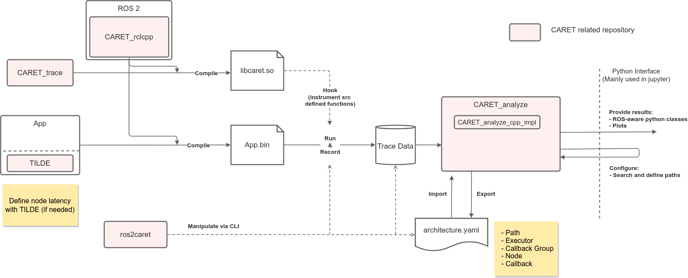

# ソフトウェアアーキテクチャ

ここではソフトウェアアーキテクチャの概要について説明します。

CARET は 3 つのフェーズに対応します。recording、構成と視覚化。

## Recording

recording フェーズでは、CARET はアプリケーションの実行時にトレースポイントから取得したイベント データを記録します。

CARETは、トレースメカニズムとしてLTTngを採用しています。LTTngセッションデーモンは、トレースポイントからイベントを収集します。
ROS 2 によって提供される `rclcpp` にはオリジナルのトレースポイントがあり、CARET もそれらの一部を使用します。CARET は、関数フックによって追加された専用のトレースポイントを収集します。
CARET では、既存のパッケージを変更する必要がなく、柔軟な方法でトレース ポイントを追加できるため、関数フックを積極的に使用します。
実装上の制約により関数フックによってトレースポイントを追加できない場合にのみ、別の方法でトレースポイントが追加されます。

記録されたイベントはすべて、CTF ベースのトレース データのセットに保存されます。ユーザーがアプリケーションのパフォーマンスと動作を観察できるように視覚化されます。

[`caret_trace`](./caret_trace.md)は、recordingを実現するための本体パッケージです。`caret_trace` は、`rclcpp`、`rcl`、および DDS で呼び出されたイベントを収集します。実際にユーザーコード内でデータが消費されるため、実際にデータが消費される時間を確認するのは不便です。[TILDE](./tilde.md) は、ユーザー コードで発生するイベントを収集するためのトレースポイントを提供します。CARET は、ユーザー コード内のイベントに飛び込むためにそれらを参照できます。

こちらも参照

- [Tracepoints](../trace_points/index.md)
- [Runtime Processing](../runtime_processing/index.md)
- [The LTTng Documentation](https://lttng.org/docs/)

## 構成

構成では、CARET は、ユーザーがデータを視覚化する前にターゲット アプリケーションの構造定義を補完することを期待します。丁寧に言うと、CARET はユーザーがノード内データ パスとノード間データ パスを定義して応答時間を計算することを期待しています。定義を機械的に取得するのは難しいため、ユーザーが指定する必要があります。

対象アプリケーションの構造体データは、[`caret_analyze`](./caret_analyze.md)で定義されるArchitectureクラスからインスタンス化されたオブジェクトに格納されます。
CARET serves Python API to deal with the object to fulfill configuration step by running script. CARET is able to store the object to a YAML-based file to be reused.

<prettier-ignore-start>
!!! info
    CARET の現在の実装では、いくつかの関数を定義する機能がサポートされていません。これらは、YAML ベースのファイルを直接編集して定義します。
<prettier-ignore-end>

構成に関連するパッケージは [caret_analyze](./caret_analyze.md) です。

[Configuration](../configuration/index.md) も参照してください。

## 視覚化

CARET はトレース データを視覚化し、ユーザーがターゲット アプリケーションのパフォーマンスと動作を観察できるようにします。

`caret_analyze` は、オブジェクトが一連の時系列データを保持する Python クラスを提供します。
ユーザーはオブジェクトから評価したいデータを取得できます。

CARET は、ユーザーがグラフィカル ビューでパフォーマンスを観察できる視覚化方法を提供します。

[caret_analyze](./caret_analyze.md) は可視化に関するパッケージです。

こちらも参照

- [Processing trace data](../processing_trace_data/index.md)
- [Event and latency definitions](../event_and_latency_definitions)
- [Bokeh](https://docs.bokeh.org/)

## ROS 2 パッケージ

以下はCARET関連のパッケージです。

|パッケージ |役割 |リポジトリ |
|----------------------------------- |----------------------------------------------------------------------------------- |---------------------------------------------------------------------------------------------------- |
|[caret_trace](./caret_trace.md) |関数フックおよびトレースポイントの状態を管理する関数を介してトレースポイントを追加します。|[https://github.com/tier4/caret_trace/](https://github.com/tier4/caret_trace/) |
|CARET_rclcpp |フォークによるトレースポイントの追加 |[https://github.com/tier4/rclcpp](https://github.com/tier4/rclcpp) |
|ros2caret |CARET CLI を提供する |[https://github.com/tier4/ros2caret/](https://github.com/tier4/ros2caret/) |
|[caret_analyze](./caret_analyze.md) |トレースデータの分析 |[https://github.com/tier4/caret_analyze/](https://github.com/tier4/caret_analyze/) |
|caret_analyze_cpp_impl |Caret_analyze を高速化する |[https://github.com/tier4/caret_analyze_cpp_impl/](https://github.com/tier4/caret_analyze_cpp_impl/) |
|[TILDE](./tilde.md) |測定するシステム内にトレースポイントを追加します。[https://github.com/tier4/TILDE](https://github.com/tier4/TILDE) |
