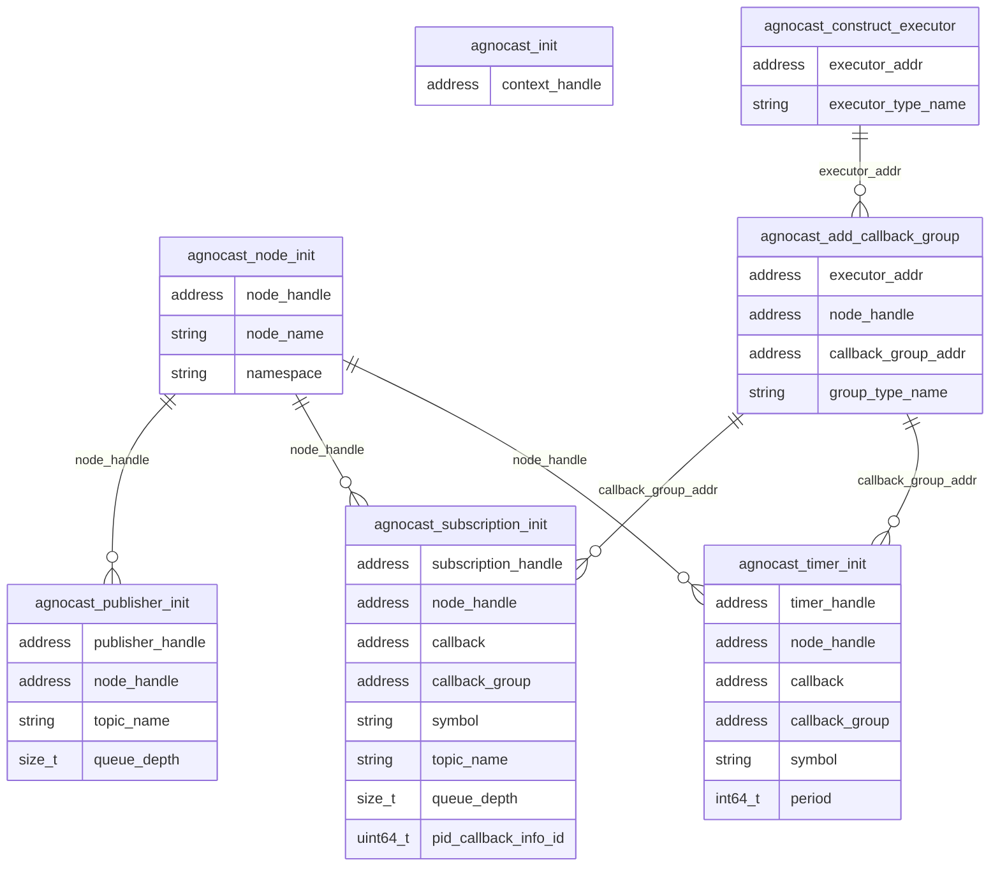

### 各 Agnocast 初期化トレース ポイントの関係

単一の agnocast ノードに関連する各トレース ポイントの関係は次のように示されます。

ROS 2 初期化トレース ポイントとは異なり、`agnocast_subscription_init` および `agnocast_timer_init` には、`callback`、`callback_group`、および `symbol` フィールドが直接含まれています。
したがって、`rclcpp_callback_register`、`callback_group_add_subscription`、`callback_group_add_timer` などの個別のトレース ポイントは必要ありません。
その結果、エグゼキュータ/コールバック グループの構造とノードの構造を 1 つの図で表現できます。

### トレースポイントの定義

#### ros2_caret:agnocast_init

[フックされたトレースポイント]

サンプル品

- void \* context_handle
- int64_t init_timestamp (caret_trace 追加)

---

#### ros2_caret:agnocast_node_init

[フックされたトレースポイント]

サンプル品

- void \* node_handle
- char \* node_name
- char \* namespace
- int64_t init_timestamp (caret_trace追加)

---

#### ros2_caret:agnocast_publisher_init

[フックされたトレースポイント]

サンプル品

- void \* Publisher_handle
- void \* node_handle
- char \* topic_name
- size_t queue_depth
- int64_t init_timestamp (caret_trace 追加)

---

#### ros2_caret:agnocast_subscription_init

[フックされたトレースポイント]

サンプル品

- void \* subscription_handle
- void \* node_handle
- void \* callback
- void \* callback_group
- char \* symbol
- char \* topic_name
- size_t queue_depth
- uint64_t pid_callback_info_id
- int64_t init_timestamp (caret_trace追加)

<prettier-ignore-start>
!!!Note
    古いバージョンでは、`pid_callback_info_id` が `pid_ciid` として記録される場合があります。
<prettier-ignore-end>

---

#### ros2_caret:agnocast_timer_init

[フックされたトレースポイント]

サンプル品

- void \* timer_handle
- void \* node_handle
- void \* callback
- void \* callback_group
- char \* symbol
- int64_t period
- int64_t init_timestamp (caret_trace 追加)

---

#### ros2_caret:agnocast_add_callback_group

[フックされたトレースポイント]

サンプル品

- void \* executor_addr
- void \* node_handle
- void \* callback_group_addr
- char \* group_type_name
- int64_t init_timestamp (caret_trace追加)

---

#### ros2_caret:agnocast_construct_executor

[フックされたトレースポイント]

サンプル品

- void \* executor_addr
- char \* executor_type_name
- int64_t init_timestamp (caret_trace追加)
