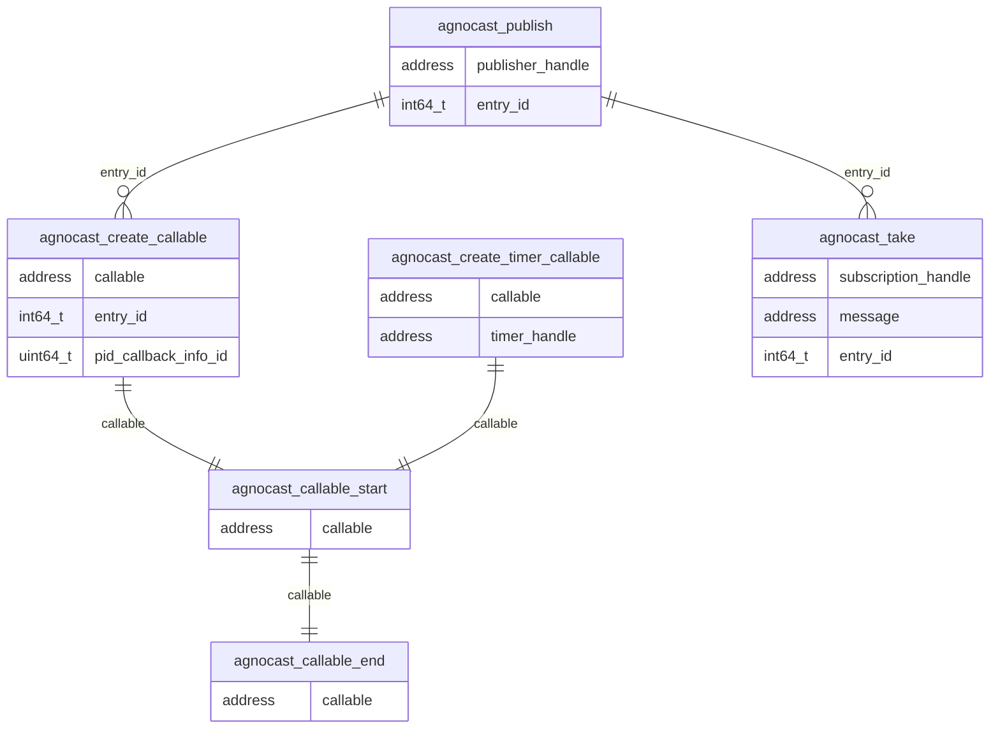

### 各 Agnocast ランタイム トレース ポイントの関係

Agnocastでは、メッセージの受け渡しにおいて`entry_id`を使用し、パブリッシュイベントとそれに対応するサブスクリプションコールバックの実行を関連付けます。
`agnocast_publish`は、`entry_id`を介して
`agnocast_create_callable`および`agnocast_take`と関連付けられています。
呼び出し可能なライフサイクル (`agnocast_callable_start` / `agnocast_callable_end`) は、`callable` アドレスを介して追跡されます。

### トレースポイントの定義

#### agnocast:agnocast_publish

[内蔵トレースポイント]

サンプル品

- void \* Publisher_handle
- int64_t entry_id

---

#### agnocast:agnocast_create_callable

[内蔵トレースポイント]

サンプル品

- void \* callable
- int64_t entry_id
- uint64_t pid_callback_info_id

<prettier-ignore-start>
!!!Note
    古いバージョンでは、`pid_callback_info_id` が `pid_ciid` として記録される場合があります。
<prettier-ignore-end>

---

#### agnocast:agnocast_create_timer_callable

[内蔵トレースポイント]

サンプル品

- void \* callable
- void \* timer_handle

---

#### agnocast:agnocast_callable_start

[内蔵トレースポイント]

サンプル品

- void \* callable

---

#### agnocast:agnocast_callable_end

[内蔵トレースポイント]

サンプル品

- void \* callable

---

#### agnocast:agnocast_take

[内蔵トレースポイント]

サンプル品

- void \* subscription_handle
- void \* message
- int64_t entry_id
