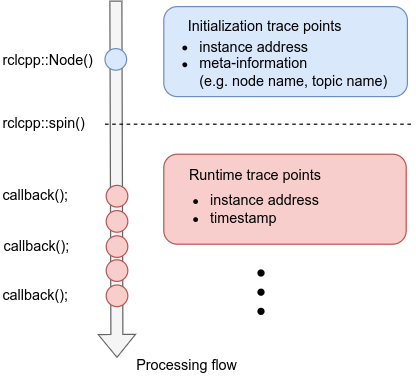
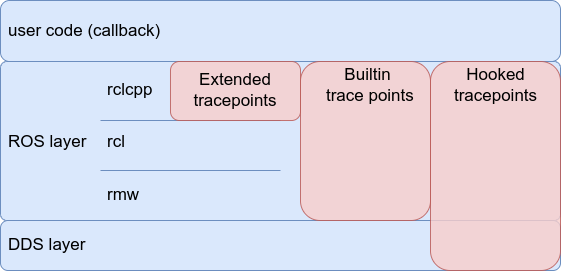

# トレースポイントの定義

このセクションでは、すべてのトレースポイントとその定義をリストします。

## トレースポイント カテゴリ

CARET は、ros2_tracing の拡張機能として実装されています。
CARET は、LTTng によって提供されるユーザー空間トレースのトレース メカニズムを使用します。
実行時のオーバーヘッドを軽減するために、トレース ポイントは 2 種類のトレースポイントに分割されます。初期化トレースポイントと実行時トレースポイント。

一部のトレースポイントは、アプリケーションの初期化中にエグゼキューター、ノード、コールバック、トピックのメタ情報を収集するために使用されます。
これらは初期化トレースポイントと呼ばれます。
他のトレースポイントは、初期化の完了後にタイムスタンプをサンプリングするために埋め込まれ、ランタイム トレースポイントと呼ばれます。

これらのトレース データをバインドすることにより、CARET は、いつ、どのコールバックが実行されたかを提供できます。

こちらも参照

- [Initialization tracepoints](./initialization_trace_points.md)
- [Runtime tracepoints](./runtime_trace_points.md)
- [Agnocast initialization tracepoints](./agnocast_initialization_tracepoints.md)
- [Agnocast runtime tracepoints](./agnocast_runtime_tracepoints.md)

## 実装方法カテゴリ

CARET の各トレースポイントは、次のいずれかの方法で追加されます。

- 組み込みトレースポイント
  - ros2-tracing で利用されるオリジナルの ROS 2 ミドルウェアに埋め込まれたトレースポイント
  - サービス、アクション、ライフサイクル ノードのトレースポイントの一部は、現在の CARET では使用されません
- フックされたトレースポイント
  - LD_PRELOAD を使用した関数フックによって導入された CARET 専用のトレースポイント
- 拡張トレースポイント
  - CARET 専用のトレースポイントが rclcpp のフォークに追加されました

CARET は、オリジナルの組み込みトレースポイント ROS 2 の一部を利用します。
一部のトレースポイントは LD_PRELOAD をフックすることによって追加され、残りのトレースポイントは ROS 2 の rclcpp のフォークに追加されます。
上記に加えて、Agnocast は独自のトレースポイントを定義します。Agnocast 初期化トレースポイント (例: `ros2_caret:agnocast_init`) はフックされたトレースポイントですが、Agnocast ランタイム トレースポイント (例: `agnocast:agnocast_publish`) は Agnocast ライブラリ自体に組み込まれています。

<prettier-ignore-start>
!!! info
    CARET 専用のトレースポイントがフォークされた rclcpp と LD_PRELOAD によって拡張されることに興味がある場合は、このセクションをお読みください。CARET は、できるだけ関数フックによってトレースポイントを追加したいと考えています。LD_PRELOAD は、ダイナミック ライブラリで定義された関数をフックするのに適していますが、C++ テンプレートで実装された関数には適用できません。このようなテンプレートベースの実装は、ビルドまたはコンパイル後にバイナリ ファイルにマップされます。組み込み rclcpp は、プロセス内通信などの一部の機能に C++ テンプレートを使用します。関数にトレースポイントを追加するために、フォークされた rclcpp が導入されました。
<prettier-ignore-end>
