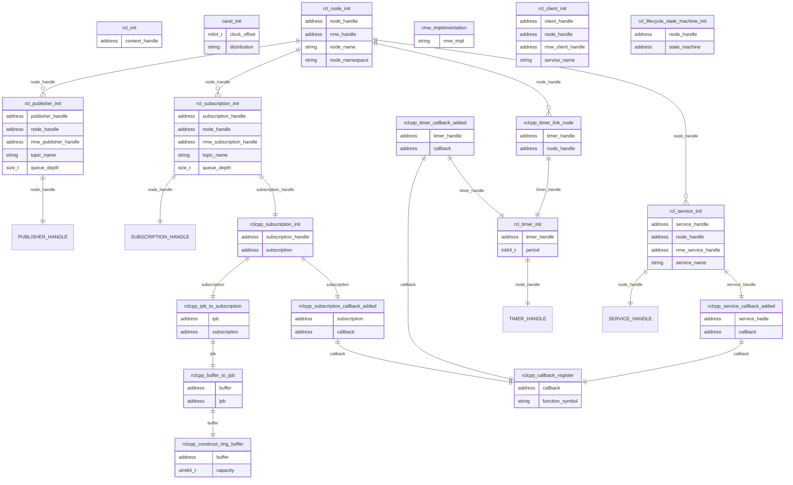
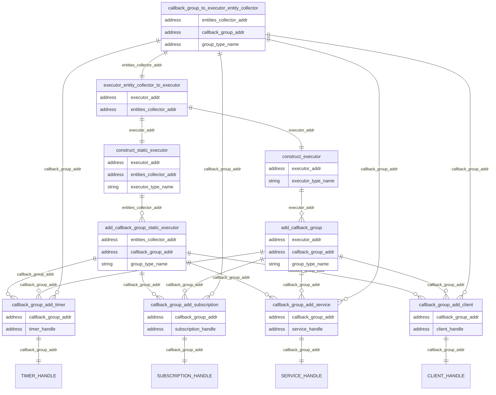

「初期化トレースポイント」は、主にNode、Executor、CallbackなどのROS構成オブジェクトの作成時に発生するトレースポイントです。
一部のトレースポイントは同じアドレスを共有します (node_handle とコールバック アドレスなど)。
これらのアドレスをバインドすることにより、CARET は各トレース ポイント関係の構造を構築します。

### 各初期化トレース ポイントの関係

単一ノードに関する各トレースポイントの関係は次のようになります。

### エグゼキュータとコールバック グループの構造を表すトレースポイント

`timer_handle` や `subscription_handle` などのハンドラーがコールバック グループに割り当てられます。コールバック グループはエグゼキュータに属します。

各トレースポイントと実行者との関係は以下のとおりです。

### トレースポイントの定義

トレースポイントの定義を以下に示します。
`timer_handle` や `subscription_handle` などのハンドラーがコールバック グループに割り当てられます。コールバック グループはエグゼキュータに属します。

`(caret_trace added)` を持つトレース ポイントは、caret_trace によってフックされ、init_timestamp が追加されます。
詳細については、[Runtime recording](../runtime_processing/runtime_recording.md#tracepoint) を参照してください。

#### ros2:rcl_init

[内蔵トレースポイント]

サンプル品

- void \* context_handle
- int64_t init_timestamp (caret_trace追加)

---

#### ros2:rcl_node_init

[内蔵トレースポイント]

サンプル品

- void \* node_handle
- void \* rmw_handle
- char \* node_name
- char \* node_namespace
- int64_t init_timestamp (caret_trace追加)

---

#### ros2:rcl_publisher_init

[内蔵トレースポイント]

サンプル品

- void \* Publisher_handle
- void \* node_handle
- void \* rmw_publisher_handle
- char \* topic_name
- size_t queue_depth
- int64_t init_timestamp (caret_trace追加)

---

#### ros2:rcl_subscription_init

[内蔵トレースポイント]

サンプル品

- void \* subscription_handle
- void \* node_handle
- void \* rmw_subscription_handle
- char \* topic_name
- size_t queue_depth
- int64_t init_timestamp (caret_trace追加)

---

#### ros2:rclcpp_subscription_init

[内蔵トレースポイント]

サンプル品

- void \* subscription_handle
- void \* subscription
- int64_t init_timestamp (caret_trace追加)

---

#### ros2:rclcpp_subscription_callback_added

[内蔵トレースポイント]

サンプル品

- void \* subscription
- void \* callback
- int64_t init_timestamp (caret_trace 追加)

---

#### ros2:rcl_service_init

[内蔵トレースポイント]

サンプル品

- void \* service_handle
- void \* node_handle
- void \* rmw_service_handle
- char \* service_name

---

#### ros2:rclcpp_service_callback_added

[内蔵トレースポイント]

サンプル品

- void \* service_handle
- void \* callback

---

#### ros2:rcl_timer_init

[内蔵トレースポイント]

サンプル品

- void \* timer_handle
- int64_t period
- int64_t init_timestamp (caret_trace追加)

---

#### ros2:rclcpp_timer_callback_added

[内蔵トレースポイント]

サンプル品

- void \* timer_handle
- void \* callback
- int64_t init_timestamp (caret_trace追加)

---

#### ros2:rclcpp_timer_link_node

[内蔵トレースポイント]

サンプル品

- void \* timer_handle
- void \* node_handle
- int64_t init_timestamp (caret_trace追加)

---

#### ros2:rclcpp_callback_register

[内蔵トレースポイント]

サンプル品

- void \* callback
- char \* function_symbol
- int64_t init_timestamp (caret_trace追加)

---

#### ros2:rclcpp_ipb_to_subscription

[内蔵トレースポイント]

サンプル品

- void \* ipb
- void \* subscription
- int64_t init_timestamp (caret_trace 追加)

<prettier-ignore-start>
!!!Note
    iron以降およびイントラ通信のみ。
<prettier-ignore-end>

---

#### ros2:rclcpp_buffer_to_ipb

[内蔵トレースポイント]

サンプル品

- void \* buffer
- void \* ipb
- int64_t init_timestamp (caret_trace 追加)

<prettier-ignore-start>
!!!Note
    iron以降およびイントラ通信のみ。
<prettier-ignore-end>

---

#### ros2:rclcpp_construct_ring_buffer

[内蔵トレースポイント]

サンプル品

- void \* buffer
- uint64_t capacity
- int64_t init_timestamp (caret_trace追加)

<prettier-ignore-start>
!!!Note
    iron以降およびイントラ通信のみ。
<prettier-ignore-end>

---

#### ros2_caret:caret_init

[フックされたトレースポイント]

サンプル品

- int64_t clock_offset
- char \* distribution

---

#### ros2_caret:rmw_implementation

[フックされたトレースポイント]

サンプル品

- char \* rmw_impl
- int64_t init_timestamp

---

#### ros2:rcl_client_init

[内蔵トレースポイント]

サンプル品

- void \* client_handle
- void \* node_handle
- void \* rmw_client_handle
- char \* service_name

---

#### ros2:rcl_lifecycle_state_machine_init

[内蔵トレースポイント]

サンプル品

- void \* node_handle
- void \* state_machine

---

#### ros2_caret:callback_group_to_executor_entity_collector

サンプル品

- void \* entities_collector_addr
- void \* callback_group_addr
- void \* group_type_name
- int64_t init_timestamp

<prettier-ignore-start>
!!!Note
    このトレース ポイントは jazzy 以降で使用できます。
<prettier-ignore-end>

---

#### ros2_caret:executor_entity_collector_to_executor

サンプル品

- void \* executor_addr
- void \* entities_collector_addr
- int64_t init_timestamp

<prettier-ignore-start>
!!!Note
    このトレース ポイントは jazzy 以降で使用できます。
<prettier-ignore-end>

---

#### ros2_caret:construct_executor

[フックされたトレースポイント]

サンプル品

- void \* executor_addr
- char \* executor_type_name
- int64_t init_timestamp

---

#### ros2_caret:construct_static_executor

[フックされたトレースポイント]

サンプル品

- void \* executor_addr
- void \* entities_collector_addr
- char \* executor_type_name
- int64_t init_timestamp

---

#### ros2_caret:add_callback_group

[フックされたトレースポイント]

サンプル品

- void \* executor_addr
- void \* callback_group_addr
- char \* group_type_name
- int64_t init_timestamp

<prettier-ignore-start>
!!!Note
    このトレース ポイントは jazzy 以降は使用できません。
<prettier-ignore-end>

---

#### ros2_caret:add_callback_group_static_executor

[フックされたトレースポイント]

サンプル品

- void \* entities_collector_addr
- void \* callback_group_addr
- char \* group_type_name
- int64_t init_timestamp

<prettier-ignore-start>
!!!Note
    このトレース ポイントは jazzy 以降は使用できません。
<prettier-ignore-end>

---

#### ros2_caret:callback_group_add_timer

[フックされたトレースポイント]

サンプル品

- void \* callback_group_addr
- void \* timer_handle
- int64_t init_timestamp

---

#### ros2_caret:callback_group_add_subscription

[フックされたトレースポイント]

サンプル品

- void \* callback_group_addr
- void \* subscription_handle
- int64_t init_timestamp

---

#### ros2_caret:callback_group_add_service

[フックされたトレースポイント]

サンプル品

- void \* callback_group_addr
- void \* service_handle
- int64_t init_timestamp

---

#### ros2_caret:callback_group_add_client

[フックされたトレースポイント]

サンプル品

- void \* callback_group_addr
- void \* client_handle
- int64_t init_timestamp
