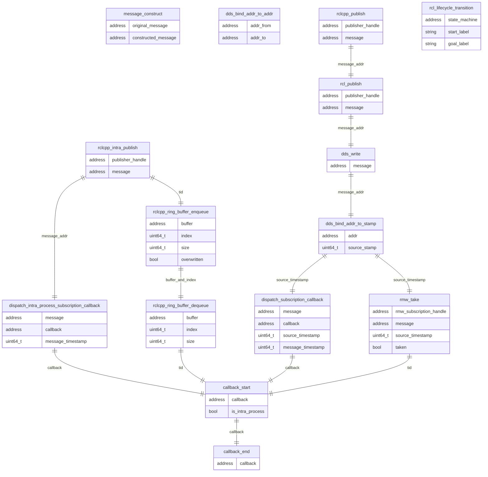

### 各実行時トレース ポイントの関係

CARETは、アドレス、スレッドID（`tid`）、および送信タイムスタンプを用いて、メッセージのパブリッシュとそれに対応するサブスクリプションのペアを特定することができます。
しかし、コールバックとパブリッシュの対応関係は自動的に取得できないため、特定のメッセージのパブリッシュをそれに対応するコールバックの実行と関連付けることは困難です。

`message_construct`(iron 以降は使用不可) および `dds_bind_addr_to_addr` は、バインド用のインスタンスのコピーと変換に適応するトレース ポイントです。

### トレースポイントの定義

#### ros2:callback_start

[内蔵トレースポイント]

サンプル品

- void \* callback
- bool is_intra_process

---

#### ros2:callback_end

[内蔵トレースポイント]

サンプル品

- void \* callback

---

#### ros2:message_construct

[拡張トレースポイント]

サンプル品

- void \*original_message
- void \* 構築された_メッセージ

<prettier-ignore-start>
!!!Note
    iron 以降は使用できません。
<prettier-ignore-end>

---

#### ros2:rclcpp_intra_publish

[拡張トレースポイント]

サンプル品

- void \* Publisher_handle
- void \* message

<prettier-ignore-start>
!!!Note
    humble では拡張トレース ポイントですが、iron 以降は組み込みトレース ポイントになります。
<prettier-ignore-end>

---

#### ros2:dispatch_subscription_callback

[拡張トレースポイント]

サンプル品

- void \* message
- void \* callback
- uint64_t ソースタイムスタンプ
- uint64_t message_timestamp

<prettier-ignore-start>
!!!Note
    このトレースポイントは、v0.4.10 以降は使用されなくなりました。
<prettier-ignore-end>

---

#### ros2:rmw_take

[内蔵トレースポイント]

サンプル品

- void \* rmw_subscription_handle
- void \* message
- int64_t \* ソースタイムスタンプ
- bool \* が取得されました

<prettier-ignore-start>
!!!Note
    CARET では、このトレースポイントは、`callback_start` をコールバックをトリガーした `rclcpp_publish` に正しくリンクするために使用されます。
    バージョン 0.4.9 までは、ros2:dispatch_subscription_callback を使用して `rclcpp_publish` および `callback_start` イベントをリンクしていました。
<prettier-ignore-end>

---

#### ros2:dispatch_intra_process_subscription_callback

[拡張トレースポイント]

サンプル品

- void \* message
- void \* callback
- uint64_t message_timestamp

---

#### ros2:rclcpp_ring_buffer_enqueue

[内蔵トレースポイント]

サンプル品

- void \* buffer
- uint64_t index
- uint64_t size
- bool overwritten

<prettier-ignore-start>
!!!Note
    iron以降およびイントラ通信のみ。
<prettier-ignore-end>

---

#### ros2:rclcpp_ring_buffer_dequeue

[内蔵トレースポイント]

サンプル品

- void \* buffer
- uint64_t index
- uint64_t size

<prettier-ignore-start>
!!!Note
    iron以降およびイントラ通信のみ。
<prettier-ignore-end>

---

#### ros2:rcl_publish

[内蔵トレースポイント]

サンプル品

- void \* Publisher_handle
- void \* message

---

#### ros2:rclcpp_publish

[内蔵トレースポイント]

サンプル品

- void \* Publisher_handle
- void \* message

#### ros2_caret:dds_write

[フックされたトレースポイント]

サンプル品

- void \* message

---

#### ros2_caret:dds_bind_addr_to_stamp

[フックされたトレースポイント]

サンプル品

- void \* addr
- uint64_t source_stamp

<prettier-ignore-start>
!!!Note
    fastdds では、GenericPublisher の publish() はこのトレースポイントを出力しません。
<prettier-ignore-end>

---

#### ros2_caret:dds_bind_addr_to_addr

[フックされたトレースポイント]

サンプル品

- void \* addr_from
- void \* addr_to

---

#### ros2_caret:rcl_lifecycle_transition

[内蔵トレースポイント]

サンプル品

- void \* state_machine
- char \* start_label
- char \* goal_label
