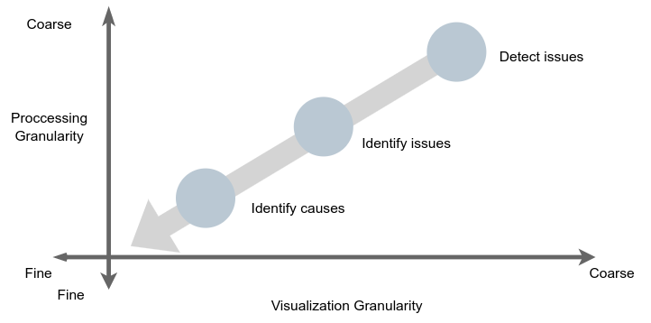
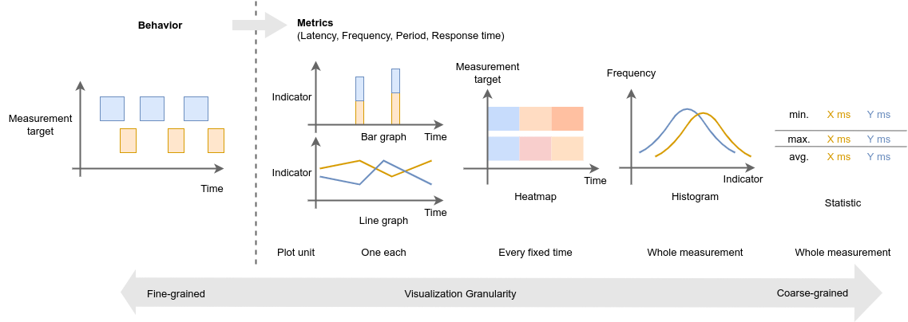
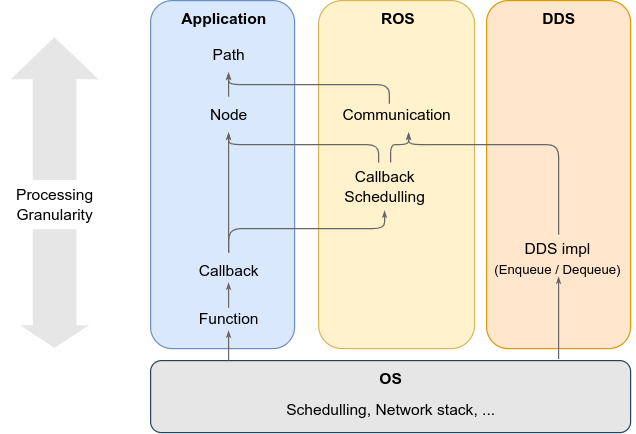

# ビジュアライゼーション

CARET は、パフォーマンスの評価と分析のためのツールです。

評価には数値化と可視化ができれば十分です。
一方、分析では、行動やパフォーマンスにはさまざまな要因が関与するため、多角的に調査する必要があります。

CARET には、評価 API と分析 API 用の複数のビジュアライゼーションがあります。
また、CARET を使用すると、自分でデータを直接取得して評価することができます (詳細は [Processing trace data](../processing_trace_data/index.md) を参照)。

## ポリシー

### 評価の流れ

CARET は大量の記録されたイベントを処理するため、アプリケーションのパフォーマンスをスムーズに調査することができません。
記録されたイベントをむやみに表示するだけでは時間を無駄にする可能性があります。
そのため、評価の目的に応じて、適切な粒度で評価対象を絞り込むことが重要です。

評価フローと粒度を調整した分析を次の図に示します。

ここで、横軸は可視化粒度を表し、縦軸は処理粒度を表します。
これらの定義については後続のセクションで説明します。

CARET は、処理と視覚化の粒度をそれぞれ変更することで、問題とその原因を見つけるのに役立ちます。
図の右上から左下に向かって、大まかな粒度から細かい粒度まで、段階的に問題とその原因にアプローチできます。

1. 問題の検出: ターゲット システム上のパフォーマンスの問題を検出します。
2. 問題の特定: 問題の原因となっているボトルネックを特定します。
3. 原因の特定: ボトルネックの原因を特定します。

横軸の処理粒度と縦軸の視覚化粒度については、次のセクションで説明します。

### 視覚化の粒度

視覚化の粒度を粒度の細かい順に以下に示します。

- 時系列トレースデータ
- 棒グラフ/折れ線グラフ
- ヒートマップ
- ヒストグラム
- 統計

粒度が粗いほど、測定を全体として評価するためにより多くの時間情報が集約されます。
最も詳細な統計は回帰テストに適しています。

一方、粒度が細かいほど詳細な情報が表現されるため、分析に適しています。
パフォーマンスを評価するために主に使用される指標は、レイテンシと応答時間です。
最も詳細な情報は、各トレース データの時系列グラフです。

### 処理の粒度

処理粒度はアプリケーション内のサブシステムの粒度を意味し、次のように大まかな順序で並べられます。

- Path
- Node/Communication
- Callback
- 関数

パスはシステムごとのパフォーマンス評価に適しており、ノードとコールバックはコンポーネントまたは小規模なサブシステムごとのパフォーマンス評価に適しています。

<prettier-ignore-start>
!!! Notice
         現時点では、CARET は任意の関数、DDS のエンキュー/デキュー、システム コールの測定をサポートしていません。
<prettier-ignore-end>

こちらも参照

- [Event and latency definition](../event_and_latency_definitions/index.md)

### メトリクス カテゴリ

ビジュアライゼーションの粒度の観点から動作とメトリクスを説明しましたが、レイテンシーや頻度など、複数のメトリクスがあります。
パフォーマンス分析のメトリクスは 2 種類に分類されます。時間関連のメトリックと頻度関連のメトリック。
CARET では、2 つのタイプに注意することをお勧めします。

- タイムドメインメトリクス (例: コールバック実行時間 [秒])
- 周波数ドメインのメトリクス (例: トピック周波数 [Hz])

どちらにも長所と短所があります。

||タイムドメインメトリクス |周波数ドメインのメトリクス |
|------ |-------------------------------------- |----------------------------------------------- |
|メトリック |レイテンシー、応答時間 |周波数 (, 周期) |
|長所 |動作環境との比較も簡単 |レイテンシやパスを定義する必要はありません。
|短所 |レイテンシーまたはパスを定義する必要があります |システム要件との比較が難しい |

上の表では、周期は連続する周期的なイベント間の時間間隔を表すメトリクスであるため、頻度に関連するメトリクスに分類されます。

こちらも参照

- [Records service](../processing_trace_data/records_service.md)
