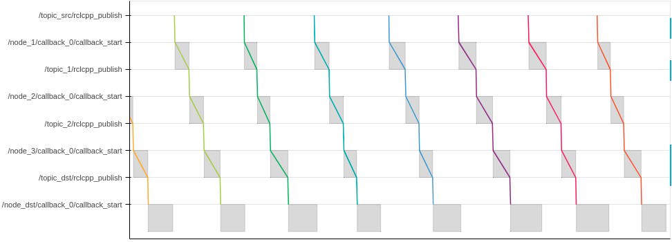
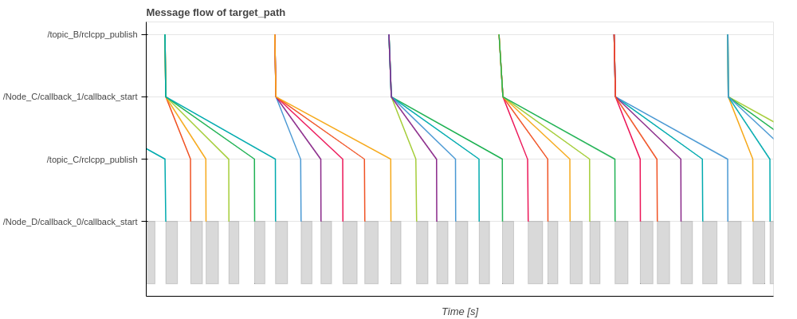
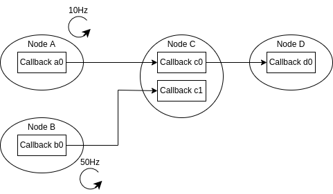
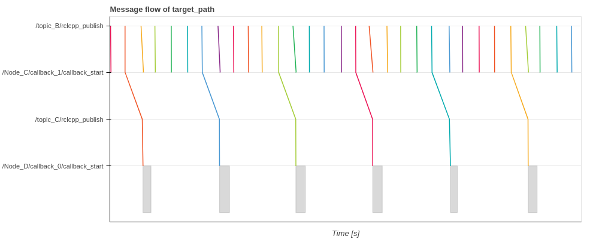
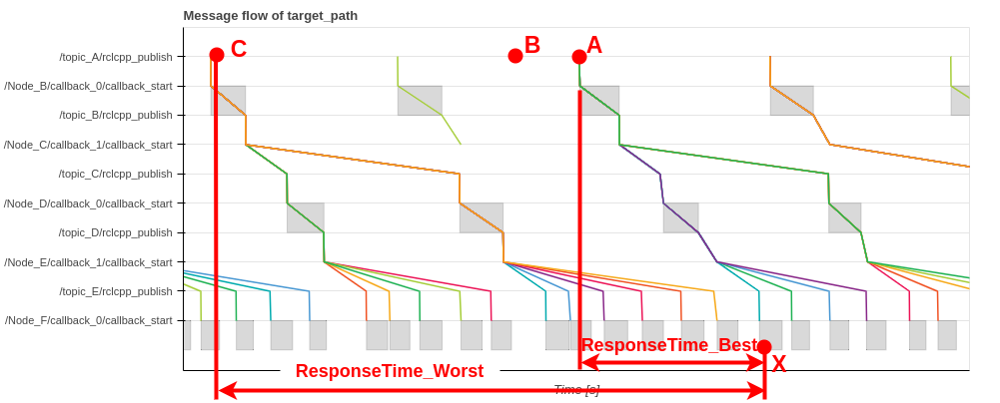

＃ よくある質問

## インストール

### セットアップが失敗する

- セットアップまたはビルドプロセス中にエラーが発生した場合は、環境に適したブランチを使用してください。
  - ROS 2 Humble、Ubuntu 22.04: メインブランチ
  - ROS 2 Iron、Ubuntu 22.04: メインブランチ
  - ROS 2 Jazzy、Ubuntu 24.04: メインブランチ
- 間違った設定を使用して CARET をビルドした場合は、CARET を再ビルドする前に、`./build` `./install` および `./src` ディレクトリを削除することも重要です

### CLI ツールが機能しない

CLIツールの実行に失敗した場合に備えて、必ずCARETの環境設定を行ってください。

```bash
source /opt/ros/humble/setup.bash
source ~/ros2_caret_ws/install/local_setup.bash

ros2 caret check_caret_rclcpp <path-to-workspace>
```

<prettier-ignore-start>
!!!warning
      CARET CLI ツールが Anaconda 環境で正しく動作しません。純粋な Python を使用してください。
<prettier-ignore-end>

### numpy2 によるインポート エラー

numpy2のリリースに伴い、環境によっては以下の警告が発生する場合があります。

> NumPy 1.x を使用してコンパイルされたモジュールは実行できません
> NumPy 2.0.1 はクラッシュする可能性があるため。1.x と 2.x の両方をサポートするには
> NumPy のバージョンでは、モジュールは NumPy 2.0 でコンパイルする必要があります。
> 一部のモジュールは代わりに再構築する必要がある場合があります。「pybind11>=2.12」の場合。

caret を使用するには、numpy を使用してパッケージを更新するだけで十分です。以下のコマンドでパッケージを更新できます。

```bash
pip3 install -U numexpr bottleneck matplotlib
```

## Recording

### LTTng セッションが `ros2 caret record` 後に開始されません

- `-verbose` オプションを追加して recording シーケンスの詳細ステータスを確認します (例: `ros2 caret record -v` )
  - `N/M process started recording` が表示されます。ここで、`N` は開始されたプロセスの数 recording 、`M` は開始されるプロセスの合計数 recording です。
- `N` の増加が非常に遅い場合は、100 より大きい整数で `--recording-frequency` オプションを追加します (例: `ros2 caret record -f 500` )
  - recording が失敗する可能性が高くなりますのでご注意ください
- `N` が 0 のままの場合、`~/.lttng` を削除し、再度 recording を開始します
  - `~/.lttng` を削除した後、最初に記録されるトレース データには一部のイベントが欠落する傾向があるので注意してください。したがって、データは無視してください
- 別の LTTng セッションが実行されていないことを確認することも重要です

### `/caret_trace_ooooooo` という名前のノードが多数作成されました

- [design section](../design/runtime_processing/index.md)で説明されているように、CARETイベントを格納するノードがプロセスごとに作成されます。したがって、対象アプリケーションが巨大でプロセス数が多い場合、CARETノードの数も膨大になります。

### Autowareと同時に起動する場合の注意事項

・ Autowareと`ros2 caret record`を同時に起動すると、動作が不安定になり、一部のノードが記録されない場合があります。
- Autoware起動後、少し時間をおいてから`ros2 caret record`を起動することを推奨します。

### 複数の ROS_DOMAIN_ID を持つシステムを測定する方法

CARET は「ROS_DOMAIN_ID」を考慮しません。測定方法に応じて、次の表のように動作します。

|**No** |**記録コマンド実行タイミング** |**記録コマンドが実行されるドメイン** |**結果** |**注意** |
|------ |-------------------------------------------------- |------------------------------------------------------------------------------ |------------------------------------------------------------------- |-------------------------------------------------------------------------------------------------------------------------------------------------- |
|1 |アプリケーションを開始する前 |任意のドメインに対して (またはドメインを指定せずに) Record コマンドを 1 回実行します。すべてのドメインが測定の対象となります。|- データは、重複する名前空間/ノード名のペアがない限り分析できます。</br>- LD_PRELOAD が設定されているドメインのみ分析できます。|
|2 |アプリケーションを開始する前 |ドメインごとに記録コマンドを実行します。サポートされていません ||
|3 |アプリケーションの実行中 |対象ドメインに対して、record コマンドを 1 回だけ実行します。|レコードが実行されたドメインが計測対象となります。|LD_PRELOAD 設定の有無は、通常、ターゲット ドメインの外では関係ありません。|
|4 |アプリケーションの実行中 |ドメインごとに記録コマンドを実行します。サポートされていません ||

## 視覚化

### 結果 (plot、message_flow など) が出力されない、または結果に問題があると思われる

- 確認には次のコマンドを使用してください。
  - `ros2 caret check_caret_rclcpp` は、ターゲット アプリケーションが CARET/rclcpp でビルドされているかどうかを確認します
  - `ros2 caret check_ctf` トレースデータが正しく記録されているかどうかを確認します
- 以下のことを確認してください。
  - ターゲット アプリケーションは CARET/rclcpp でビルドされます
  - CARET 環境はターゲット アプリケーションを実行する前に適切に設定されています
    - `export LD_PRELOAD=$(readlink -f ~/ros2_caret_ws/install/caret_trace/lib/libcaret.so)`
    - `source ~/ros2_caret_ws/install/local_setup.bash`
  - LTTng トレースはターゲット アプリケーションを実行する前に開始されます
    - `ros2 trace -s e2e_sample -k -u "ros2*"`
    - または起動ファイルの使用を検討してください
  - トレースデータは破棄されません
    - トレースデータを破棄する場合は[Trace filter](../recording/trace_filtering.md)を使用してください
  ・トレースデータのサイズが適切であること
    - トレース データのサイズが非常に小さく (例: 数 K バイトのみ)、ターゲット アプリケーションに多数のノードがある場合、ファイル ディスクリプタの最大数が十分でない可能性があります。`ulimit -n 65536` ずつ増やすことができます
- 詳細については [Recording](../recording/index.md) を参照してください

### 結果の一部が出力されない

- 特定のノードがトレースされず、一部のノードがトレースされる場合、一部のパッケージは CARET/rclcpp なしでビルドされる可能性があります。`package.xml`に`<depend>rclcpp</depend>`が記載されていることを確認してください
- もう 1 つの可能性は、CARET の制限により一部のノードを分析できないことです。
  - CARET は、同じ周期時間設定のタイマー コールバックが 2 つ以上あるノードを分析できません
  - CARET は、同じトピック名のサブスクリプション コールバックが 2 つ以上あるノードを分析できません
・ 該当ノードのコールバック情報は出力されません。また、メッセージ フローはそのようなノードで中断されます。

### `TraceResultAnalyzeError: Failed to find` エラーが発生しました

・ アーキテクチャファイルとトレースデータの情報が一致しない場合にエラーが発生する
- アーキテクチャ ファイルを変更するか、recording プロセスを確認してください
- 例:
  - `TraceResultAnalyzeError: Failed to find callback_object.node_name: /localization/pose_twist_fusion_filter/ekf_localizer, callback_name: timer_callback_0, period_ns: 19999999, symbol: void (EKFLocalizer::?)()`

## 視覚化 (コールバック)

### コールバック頻度が期待値より小さい

- `Plot.create_callback_frequency_plot` は、1 秒から 1 秒までの頻度を計算します。コールバック関数が 1 秒間に呼び出された回数をカウントし、その回数を頻度として使用します。したがって、最終項は通常 1 秒未満であるため、最終項の頻度は小さくなる傾向があります。
- もう 1 つの可能性は、定期的ではなく頻繁にトピックを受信する場合、サブスクリプション コールバックの頻度が小さくなるということです。また、タイマーが動的に停止/開始する場合、タイマー コールバックの頻度は低くなります。

### コールバックの遅延が予想値よりも大きい

- 一部のノードでは初期化プロセスが実行される場合があります。この場合、`Plot.create_callback_latency_plot` によって計算される待ち時間は、最初の実行時に非常に大きくなります。

## 視覚化 (メッセージフロー)

### メッセージフロー が途中までしか表示されません

- recording 中にノード/通信の一部がまったく実行されない場合、メッセージ フローが途中で停止し、そのようなノード/通信は y 軸に表示されません。
  - ターゲット パス内のすべてのノード/通信が recording 中に実行されていることを確認するか、ターゲット パスを変更して実際に動作しているパスを分析してください。
- もう 1 つの可能性は、ターゲット パスに、上で説明した制限により CARET が分析できないノードが含まれていることです。

### メッセージフロー図の灰色の四角形とは何ですか?

- メッセージフロー図の四角形はコールバック関数の入口から出口までの期間を示し、線はトピックの流れを示します。
- 注: 長方形が常に図示されているわけではありません



### トピックのパブリッシュとコールバックの開始の間の大きな遅延

- メッセージフロー図において、`ooo/rclcpp_publish` から `ooo/callback_start` までの経過時間は、トピックがパブリッシュされてから次のコールバックが開始されるまでの待ち時間を意味します。
- これには以下の時間が含まれます。
  - 通信（トピック）レイテンシ
  - ROSスケジューラによる待機
  - OSスケジューラによる待機
- ほとんどの場合、それほど時間はかかりません。時間がかかる場合には、以下の原因が考えられます。
  - コミュニケーションに問題がある
  - 他のプロセスが CPU を占有しているため、エグゼキュータが起動できない
  - 同じコールバック グループ内の他のコールバックがエグゼキュータを占有しているため、コールバックをウェイクアップできません
  - コールバックの処理時間がトピックサブスクライブ期間よりも長い

### メッセージフローが分割されているように見える

- 以下のシステムを例に挙げます。
  - `Node_C` は、`Node_A` からトピックを受信したときにトピックを公開します
  - `Node_A` は 50 Hz のレートでトピックを公開しますが、`Node_B` は 10 Hz でトピックを公開します
- メッセージフロー (`Node_B` -> `Node_C` -> `Node_D`) は `Node_C` で分割されているように見えます。`Node_C` が 5 つのトピックを公開し、`Node_B` から 1 つのトピックを受信して​​いるためです。
- 注: `Callback c0` がタイマコールバックの場合でも同様の現象が発生します。




### メッセージフローがドロップされたように見える

- 以下のシステムを例に挙げます。
  - `Node_C` は、`Node_A` からトピックを受信したときにトピックを公開します
  - `Node_A` は 10 Hz のレートでトピックをパブリッシュしますが、`Node_B` は 50 Hz のレートでトピックをパブリッシュします
- メッセージフロー (`Node_B` -> `Node_C` -> `Node_D`) は、5 つのメッセージごとに 4 回 `Node_C` で切断されているように見えます。これは、`Node_C` が 1 つのトピックを公開している一方で、`Node_B` から 5 つのトピックを受信して​​いるためです。したがって、4 つのトピックには、`Node_D` に公開される対応するトピックがありません。
- 注: `Callback c0` がタイマー コールバックの場合でも同様の現象が発生します。





### 応答時間はどのように計算されますか?

- 一般に、応答時間は、システムまたは機能ユニットが特定の入力 ([reference](<https://en.wikipedia.org/wiki/Response_time_(technology)>) に反応するのにかかる時間です。CARET で計算される応答時間は、入力データが最後のノードに到着するまでにかかる時間です。最初/最後のノードでの処理時間やアクチュエーターの待ち時間は含まれません。パス内の通信待ち時間 (ノードがトピックを発行した時間から次のノードがトピックを購読する時間まで) とノードの待ち時間 (ノードがトピックを購読した時間から別のトピックを発行する時間まで) の合計として計算されます。
  - 次の図では、A 点の入力データが最初に X 点の出力に反映されます (`ResponseTime_Best`)
  - `ResponseTime_Best` はパス (データフロー) レイテンシ時間と見なすことができます
  - `ResponseTime_Best` は、次の最悪のシナリオとは対照的に、幸せなケースと考えることができます。
・入力情報が物体検知センサーなどのセンサーにより生成されることを想定し、センサーの遅延を考慮する必要がある。たとえば、新しいオブジェクトがポイント B に出現した場合、ポイント B からポイント A までの時間が応答時間に追加されます。最悪のシナリオは、前のフロー (ポイント C) の直後に新しいオブジェクトが現れることです。最悪の場合の応答時間は `ResponseTime_Worst` として表示されます。
- CARET は、次の API を使用して `ResponseTime_Best` と `ResponseTime_Worst` の両方を計算できます。
  - `response_time.to_best_case_timeseries()`、`response_time.to_best_case_histogram()`
  - `response_time.to_worst_case_timeseries()`、`response_time.to_best_worst_histogram()`
- CARET は `response_time.to_histogram()` API も提供します。ヒストグラムのビン サイズの間隔で点 C から点 A まで新しいオブジェクトが出現すると仮定してヒストグラムを作成します



### RelayNode を使用するとメッセージフローが壊れる

- RelayNodeを使用すると、Message_flowが壊れることがあります。
  RelayNode は、通常のパブリッシャとサブスクリプションの代わりに、GenericPublisher と GenericSubscription を使用します。
  これらのクラスには、CARET による分析に必要なトレース ポイントがありません。

- GenericPublisher または GenericSubscription を使用するノードを記録する場合は、[caret-rclcpp](https://github.com/tier4/rclcpp/tree/humble_tracepoint_added) を使用してノードを再構築し、`--light` オプションを使用して記録する必要があります。
  RelayNode を再構築する手順は次のとおりです。

1. [topic_tools](https://github.com/ros-tooling/topic_tools) のクローンをワークスペースに作成します。このワークスペースには ros2_caret_ws を選択できます。

   ```bash
   cd /path/to/workspace
   mkdir src
   cd src
   git clone https://github.com/ros-tooling/topic_tools -b humble
   ```

2. caret-rclcpp を使用して topic_tools をビルドします。

   ```bash
   cd /path/to/workspace
   source /opt/ros/humble/setup.bash
   source ~/ros2_caret_ws/install/local_setup.bash
   colcon build --symlink-install --cmake-args -DCMAKE_BUILD_TYPE=Release
   ```

RelayNode を実行する前に、必ずこのワークスペースの local_setup.bash を取得してください。

<prettier-ignore-start>
!!! Note
    caret の iron バージョンは、汎用通信のトレース ポイントを追加しないため、RelayNode 分析をサポートしていません。
<prettier-ignore-end>
