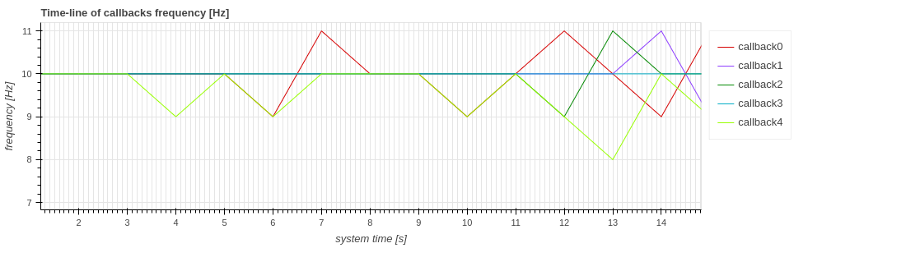
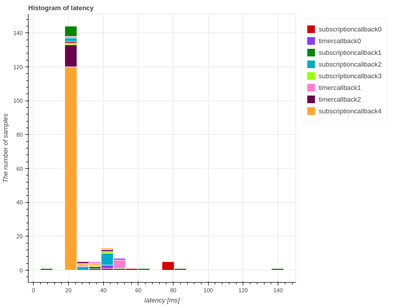
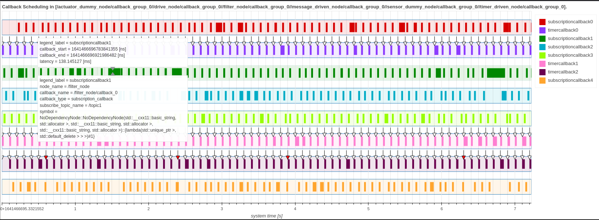

# ギャラリー

このページではCARETで可視化できる数値の例を示します。
興味のある内容が見つかったら、見出しに埋め込まれたリンクにアクセスしてください。

## 時系列

### [Callback frequency graph](./visualization/frequency/index.md)

#### 次の要素を視覚化できます

- コールバックの頻度
- 通信周波数
- パブリッシュ/サブスクライブの頻度
- コールバック遅延
- 通信遅延
- コールバック期間
- 通信期間
- Pub/Sub期間
- パスの応答時間

## ヒストグラム

### [callback latency graph](./visualization/latency/index.md)

#### 次の要素を視覚化できます

- コールバックの頻度
- 通信周波数
- パブリッシュ/サブスクライブの頻度
- コールバック遅延
- 通信遅延
- コールバック期間
- 通信期間
- Pub/Sub期間
- パスの応答時間

## スタックバー

### [Path Response time graph](./visualization/path/response_time.md)

## メッセージフロー

### [Path graph](./visualization/path/message_flow.md)

## [Callback Scheduling Visualization](./visualization/scheduling/callback.md)

### [Callback graph](./visualization/scheduling/callback.md)

#### 次の要素を視覚化できます

- パスコールバックのスケジューリング
- アプリケーションのコールバックのスケジューリング
- エグゼキュータのコールバックのスケジューリング
- ノードのコールバックのスケジューリング
- CallbackGroup コールバック スケジューリング
- 複数の CallbackGroup コールバック スケジューリング

## チェーンレイテンシ

### [Path graph](./visualization/path/chain_latency.md)

