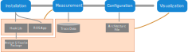

# チェーン対応 ROS 評価ツール (CARET)

CARET は、ROS 2 アプリケーション専用のパフォーマンス分析ツールの 1 つです。コールバックレイテンシや通信レイテンシだけでなく、パスレイテンシ、つまりノードやコールバックチェーンも測定できます。追加のトレースポイントが関数フックによって導入されるため、トレースの解像度が向上します。

特徴と機能を以下に示します。

特徴：

- ROS/DDS レイヤでイベントをサンプリングするための LTTng ベースのトレースポイントによる低オーバーヘッド
- LD_PRELOADによる関数フックにより柔軟なトレースポイントを追加
- 柔軟なデータ分析と視覚化のための Python ベースの API
- ランタイムメッセージトレーサ TILDEとの連携によるアプリケーション層のイベント追跡

能力:

- さまざまな側面からのパフォーマンス測定
  - コールバックのレイテンシ、頻度、期間
  - トピック通信のレイテンシ、頻度、期間
  - ノードのレイテンシ
  - パスの遅延
    - 入力から出力までのパスが選択されている場合のソフトウェアのエンドツーエンドの遅延
- コールバック実行のスケジューリングの可視化
- 特定のノードやトピックを無視するフィルタリング機能
- トレース対象パスの検索
- バッファされたトピックメッセージの消費などのアプリケーションイベントのトレース
  - `/tf` (v0.3.x リリース予定)
  - `message_filters` (TILDE でサポート)
  - `image_transport` (TILDE でサポート)

## CARET によるフローのトレース

CARET は、[`ros2_tracing`](https://gitlab.com/ros-tracing/ros2_tracing) の元のトレースポイントを利用しながら、ROS と DDS 層に新しいトレースポイントを導入してアプリケーションをトレースする機能を提供します。

CARET はソースコードとしてのみ提供されており、今のところ `apt` パッケージとしては提供されていません。
CARET は、トレースポイントを追加するために、動的ライブラリで定義された関数に専用関数をフックします。
CARET 専用のトレースポイントを持つ rclcpp のフォークが配信されます。
使用したい場合は、CARET とアプリケーションをビルドする必要があります。

CARET を使用してアプリケーションを実行すると、イベント、メタデータ、タイムスタンプを含む記録データが取得されます。データセットを分析する前に、ノードレイテンシとターゲットパスを定義するアーキテクチャファイルと呼ばれる構成ファイルを作成する必要があります。

データ分析用の API を含むアーキテクチャ ファイルと `caret_analyze` パッケージを使用してトレース データを視覚化します。
`caret_analyze` は、Jupyter Notebook 上でトレースデータを解析することを前提に設計されています。

## コンテンツリスト

### インストール

Ansible を使用したインストールは、次のページに示すように提供されます。

- [Installation](./installation/installation.md)

### チュートリアル

試してみたい場合は、これらのページを参照してください。

- [Recording](./tutorials/recording.md)
- [Configuration](./tutorials/configuration.md)
- [Visualization](./tutorials/visualization.md)

### 設計

- [Index](./design)
- [Software architecture](./design/software_architecture/index.md)
- [Processing trace data](./design/processing_trace_data/index.md)
- [Runtime processing](./design/runtime_processing/index.md)
- [Tracepoints](./design/trace_points/index.md)
- [Configuration](./design/configuration/index.md)
- [Limits and constraints](./design/limits_and_constraints/index.md)

### 分析の各ステップの詳細

CARET は、アプリケーションを効率的に分析するための便利な機能を提供します。分析の各ステップの詳細な説明を参照してください。

- [Recording](./recording)
- [Configuration](./configuration)
- [Visualization](./visualization/)

### APIリスト

CARET は、パフォーマンスを視覚化して分析するための強力な API を提供します。API リストは、別のリポジトリ `caret_analyze` にあります。

- [API list](https://tier4.github.io/caret_analyze/latest/) (外部リンク)

API には [for user](https://tier4.github.io/caret_analyze/latest/architecture/) と [for developer](https://tier4.github.io/caret_analyze/latest/common/) の 2 種類があります。

## 関連リポジトリ

CARET は次のパッケージで構成されています

- [caret_trace](https://github.com/tier4/caret_trace) ｜ 関数フックにより追加されたトレースポイントを定義
- [caret_analyze](https://github.com/tier4/caret_analyze) ｜ データを分析および視覚化するためのスクリプトのライブラリ
- [caret_analyze_cpp_impl](https://github.com/tier4/caret_analyze_cpp_impl.git) ｜ C++で書かれたトレースデータを分析するための効率的なヘルパー関数
- [ros2caret](https://github.com/tier4/ros2caret.git) ｜ `ros2 caret` のような CLI コマンド
- [caret_demos](https://github.com/tier4/caret_demos) ｜ CARET のデモ プログラム
- [caret_doc](https://github.com/tier4/caret_doc) ｜ ドキュメント
- [rclcpp](https://github.com/tier4/rclcpp/tree/rc/v0.3.0) ｜ CARET 専用のトレースポイントを含む、フォークされた `rclcpp`
- [ros2_tracing](https://github.com/tier4/ros2_tracing/tree/rc/v0.3.0)｜ CARET 専用のトレースポイントの定義を含む、フォークされた `ros2_tracing`

---

このソフトウェアは、国立研究開発法人新エネルギー・産業技術総合開発機構（NEDO）の補助事業による成果をもとに開発されました。
