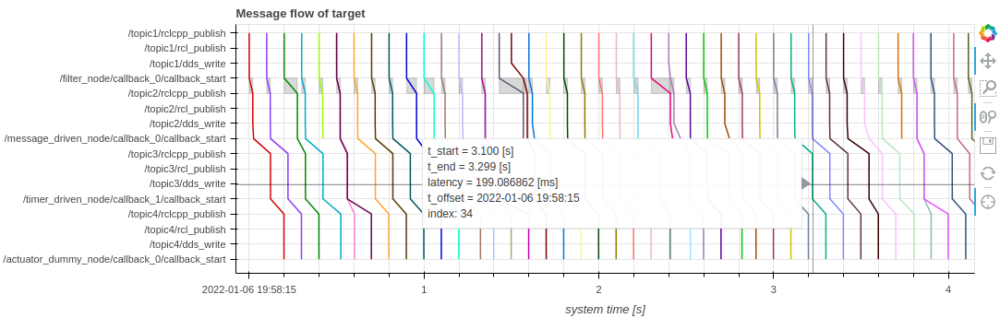

# パフォーマンスの視覚化

CARET は、ユーザーがアプリケーションのパフォーマンスを分析できるようにトレース データを視覚化する Python API を提供します。
Jupyter Notebook でデータを可視化する基本的な流れを説明します。

## Jupyter Notebook でトレース データを見つける方法

1. `jupyter-lab`の起動
   記録されたデータを視覚化する方法を学ぶために、最初に `jupyter-lab` を起動します。

   ```bash
   cd ~/ros2_ws/evaluate

   source ~/ros2_caret_ws/install/setup.bash
   jupyter-lab
   ```

   CARET は、一部の視覚化 API に [`bokeh`](https://bokeh.org/) を使用します。
   `bokeh` をロードするには次のコードを実行します。

   ```python
   from bokeh.plotting import output_notebook
   output_notebook()
   ```

2. Jupyter Notebook へのトレースデータの読み込み

   Jupyter ノートブック上のトレース データとアーキテクチャ ファイルを見つけます。

=== "humble"

    ``` python
    from caret_analyze import Architecture, Application, Lttng

    # load the architecture file which is created in the previous page
    arch = Architecture('yaml', './architecture.yaml')

    # load recorded data by CARET
    lttng = Lttng('./e2e_sample')

    # map the application architecture to recorded data
    app = Application(arch, lttng)
    ```

=== "iron"

    ``` python
    from caret_analyze import Architecture, Application, Lttng

    # load the architecture file which is created in the previous page
    arch = Architecture('yaml', './architecture.yaml')

    # load recorded data by CARET
    lttng = Lttng('./e2e_sample')

    # map the application architecture to recorded data
    app = Application(arch, lttng)
    ```

=== "jazzy"

    ``` python
    from caret_analyze import Architecture, Application, Lttng

    # load the architecture file which is created in the previous page
    arch = Architecture('yaml', './architecture_jazzy.yaml')

    # load recorded data by CARET
    lttng = Lttng('./e2e_sample')

    # map the application architecture to recorded data
    app = Application(arch, lttng)
    ```

コードの実行後、ユーザーは多くの場合、`Application` クラスとして定義された `app` オブジェクトを参照します。`app` オブジェクトは、コールバック、通信、パスの遅延をユーザーに提供します。`Application` クラスは、アプリケーションの構造を記述する `Architecture` クラスと似ており、そのインターフェイスも似ています。さらに、`Application` クラスにはレイテンシを取得するためのインターフェイスがあります。

## レイテンシを取得するための基本的な API

このセクションでは、コールバック レイテンシを取得するための API について説明します。次のコードは、コールバック レイテンシを取得する例の 1 つです。

```python
# Get a callback instance, which has latency information, from app
callback = app.get_callback('/timer_driven_node/callback_0')

# Get time-series variation of latency
t, latency_ns = callback.to_timeseries()

# Get histogram of latency
bins, latency_ns = callback.to_histogram()
```

この例ではコールバック レイテンシを示していますが、CARET は通信レイテンシを取得する API を提供します。
`callback.to_dataframe()` は、トレースポイントから取得された生のタイムスタンプを含む `pandas.DataFrame` ベースのオブジェクトを提供します。

<prettier-ignore-start>
!!! todo
        CARET の API リストを提供していないのが残念ですが、近い将来提供する予定です。
<prettier-ignore-end>

## メッセージフローによるノードチェーンレイテンシの可視化

CARET は、測定データを視覚化するための API をいくつか提供します。
効果的な視覚化の一つであるメッセージフローを利用すると、対象アプリケーションで何が起こっているのか、どこがボトルネックになっているのかを把握することができます。
メッセージフローを視覚化するには、次のコードを実行します。

```python
from caret_analyze.plot import Plot

target_path = app.get_path('target')
plot = Plot.create_message_flow_plot(target_path)
plot.show()
```

`show` メソッドが成功すると、次の図が表示されます。



横軸は時間軸を示します。一方、縦軸はノードチェーンの要素 (`target`) を示します。これには、入力から出力までのコールバック関数とトピック メッセージが含まれます。カラフルな各線は、特定の入力メッセージがコールバック関数やトピック通信にどのように伝播されるかを示しています。灰色の四角形はコールバック関数の実行タイミングを示します。

マウスポインタを灰色の四角形の上に置くと、コールバック関数のレイテンシが表示されます。マウスポインタをカラフルな線の 1 つに置くと、ターゲットノードチェーンのレイテンシも確認できます。

CARET は、視覚化のための他の API を提供します。詳細については、[visualization](../visualization/index.md)を参照してください。
