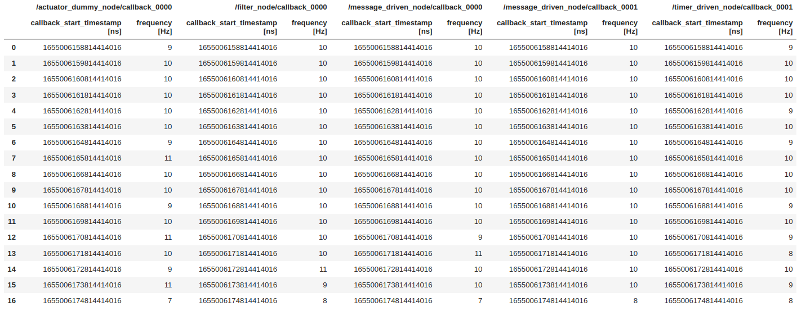
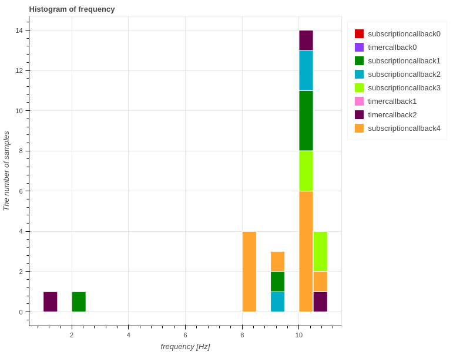
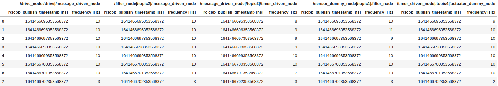
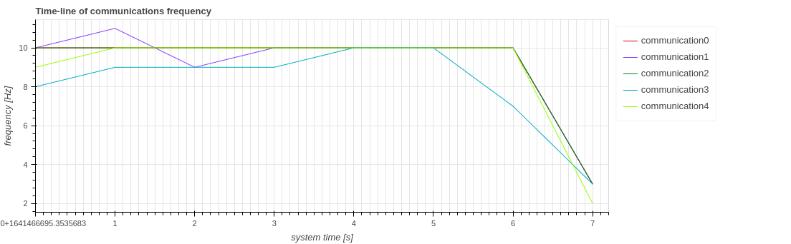
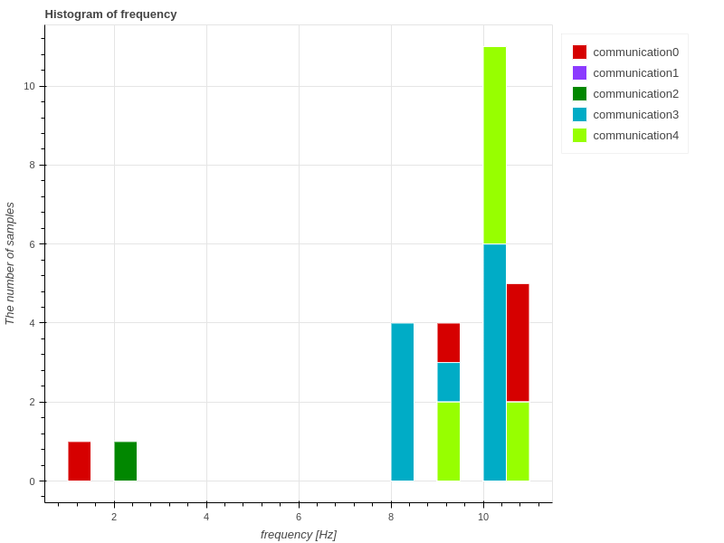
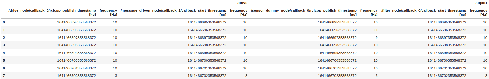
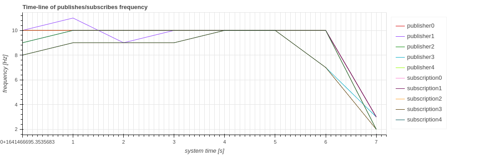

# 頻度

CARET は、コールバックの実行、メッセージ通信、パブリッシャーまたはサブスクリプションの呼び出しの頻度を表示できます。
`Plot.create_frequency_timeseries_plot(target_object)` インターフェイスが提供されています。
このセクションでは、それらのサンプル視覚化スクリプトについて説明します。
このメソッドを呼び出す前に、次のスクリプト コードを実行してトレース データとアーキテクチャ オブジェクトを読み込みます。

```python
from caret_analyze.plot import Plot
from caret_analyze import Application, Architecture, Lttng
from bokeh.plotting import output_notebook, figure, show
output_notebook()
arch = Architecture('yaml', '/path/to/architecture_file')
lttng = Lttng('/path/to/trace_data')
app = Application(arch, lttng)
```

## Callback

`Plot.create_frequency_timeseries_plot(callbacks: Collections[CallbackBase])` および `Plot.create_frequency_histogram_plot(callbacks: Collections[CallbackBase])` は、対象のコールバック関数が必要な頻度で実行されているかどうかを確認するために導入されました。

```python
### Timestamp tables
plot = Plot.create_frequency_timeseries_plot(app.callbacks)
frequency_df = plot.to_dataframe()
frequency_df

# ---Output in jupyter-notebook as below---
```



### 時系列

```python
### Time-series graph
plot = Plot.create_frequency_timeseries_plot(app.callbacks)
plot.show()

# ---Output in jupyter-notebook as below---
```


横軸は時間を意味し、`Time [[_FIX_ID_0_]], and 0-based ordering. One of `'system_time'[​​[_FIX_ID_2_]]'sim_time'[​​[_FIX_ID_3_]]'index'` is chosen as `xaxis_type` though `'system_time'` とラベル付けされており、デフォルト値です。
縦軸はコールバックの実行頻度を意味し、`Frequency [Hz]` とラベル付けされています。1 秒ごとにプロットされます。

### ヒストグラム

```python
### Time-series graph
plot = Plot.create_frequency_histogram_plot(app.callbacks)
plot.show()

# ---Output in jupyter-notebook as below---
```



横軸は周波数を表し、`frequency [Hz]` というラベルが付けられます。縦軸は、各周波数で実行されたサンプル数を表し、`The number of samples` とラベル付けされています。

## コミュニケーション

`Plot.create_frequency_timeseries_plot(communications: Collection[Communication])` と `Plot.create_frequency_timeseries_plot(communications: Collection[Communication])` は、対象のトピックが予想される頻度で伝達されていることを確認するために導入されました。
ここで、CARET は、メッセージの送信と受信の両方が失われずに正常に実行された場合の通信を考慮しています。
詳細については、[Premise of communication](../premise_of_communication.md) を参照してください。

```python
### Timestamp tables
plot = Plot.create_frequency_timeseries_plot(app.communications)
frequency_df = plot.to_dataframe()
frequency_df

# ---Output in jupyter-notebook as below---
```



### 時系列

```python
### Time-series graph
plot = Plot.create_frequency_timeseries_plot(app.communications)
plot.show()

# ---Output in jupyter-notebook as below---
```



横軸は `Time [s]` とラベル付けされた時間を意味し、縦軸は `Frequency [Hz]` とラベル付けされた通信頻度とコールバック実行の時系列グラフを示します。`xaxis_type` 引数も提供されます。

### ヒストグラム

```python
### Time-series graph
plot = Plot.create_frequency_histogram_plot(app.communications)
plot.show()

# ---Output in jupyter-notebook as below---
```



横軸は周波数を表し、`frequency [Hz]` というラベルが付けられます。縦軸は、各周波数で実行されたサンプル数を表し、`The number of samples` とラベル付けされています。

## パブリッシュとサブスクリプション

`Plot.create_frequency_timeseries_plot(Collection[publish: Publisher or subscription: Subscriber])` は、ターゲットのパブリッシャーまたはサブスクリプションが呼び出される頻度を確認するために導入されました。

```python
### Timestamp tables
plot = Plot.create_frequency_timeseries_plot(*app.publishers, *app.subscriptions)
frequency_df = plot.to_dataframe()
frequency_df

# ---Output in jupyter-notebook as below---
```



```python
### Time-series graph
plot = Plot.create_frequency_timeseries_plot(*app.publishers, *app.subscriptions)
plot.show()

# ---Output in jupyter-notebook as below---
```



横軸は `Time [s]` とラベル付けされた時間を意味し、縦軸は `Frequency [Hz]` とラベル付けされたパブリッシュまたはサブスクリプションの呼び出し頻度とコールバック実行の時系列グラフを意味します。`xaxis_type` 引数も提供されます。
