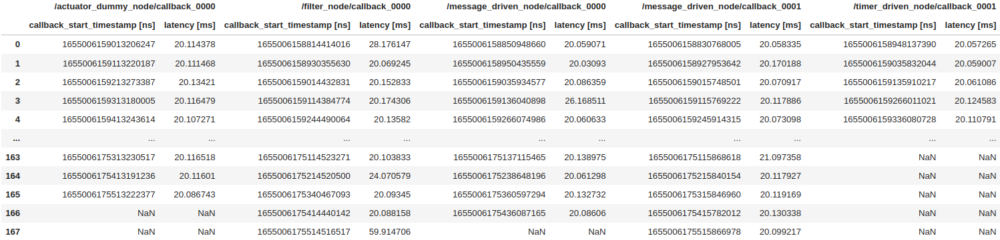
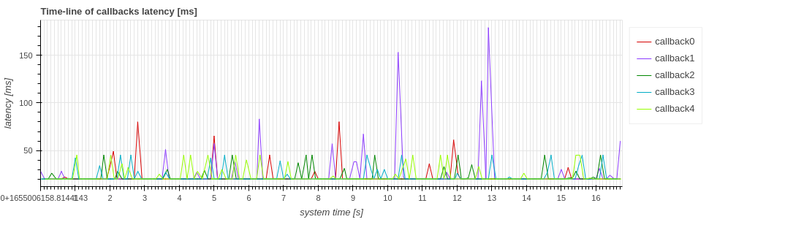
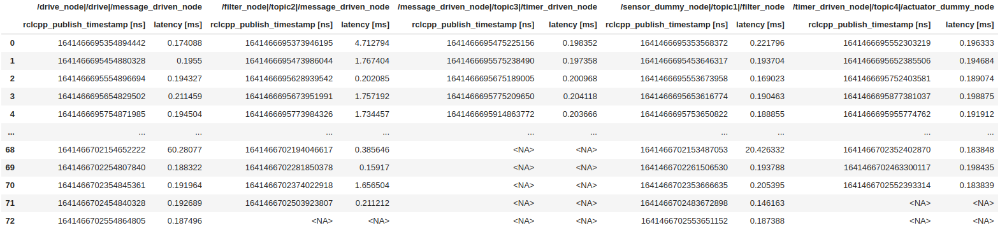
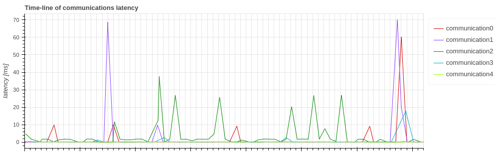
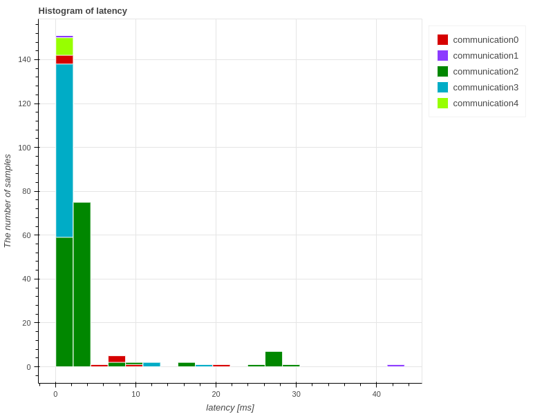

# レイテンシ (または実行時間)

CARET は、コールバック実行、メッセージ通信のレイテンシを表示できます。`Plot.create_latency_timeseries_plot(target_object)` インタフェイスが提供されています。
このセクションでは、それらのサンプル視覚化スクリプトについて説明します。
このメソッドを呼び出す前に、次のスクリプトコードを実行してトレースデータとアーキテクチャオブジェクトを読み込みます。

```python
from caret_analyze.plot import Plot
from caret_analyze import Application, Architecture, Lttng
from bokeh.plotting import output_notebook, figure, show
output_notebook()
arch = Architecture('yaml', '/path/to/architecture_file')
lttng = Lttng('/path/to/trace_data')
app = Application(arch, lttng)
```

## Callback

`Plot.create_latency_timeseries_plot(callbacks: Collections[CallbackBase])` および `Plot.create_latency_histogram_plot(callbacks: Collections[CallbackBase])` は、コールバック関数の実行時間を確認するために提供されます。

```python
### Timestamp tables
plot = Plot.create_latency_timeseries_plot(app.callbacks)
latency_df = plot.to_dataframe()
latency_df

# ---Output in jupyter-notebook as below---
```



### 時系列

```python
### Time-series graph
plot = Plot.create_latency_timeseries_plot(app.callbacks)
plot.show()

# ---Output in jupyter-notebook as below---
```



横軸は時間を意味し、`Time [[_FIX_ID_0_]], and 0-based ordering. One of `'system_time'[​​[_FIX_ID_2_]]'sim_time'[​​[_FIX_ID_3_]]'index'` is chosen as `xaxis_type` though `'system_time'` とラベル付けされており、デフォルト値です。
縦軸はコールバック関数の実行時間を意味し、`Latency [ms]`とラベル付けされています。`callback_start` から `callback_end` までの期間がサンプルごとにプロットされます。

### ヒストグラム

```python
### Histogram graph
plot = Plot.create_latency_histogram_plot(app.callbacks)
plot.show()

# ---Output in jupyter-notebook as below---
```


横軸はレイテンシを表し、`latency [ms]` というラベルが付いています。縦軸は、各レイテンシで実行されるサンプルの数を表し、`The number of samples` というラベルが付けられます。

## コミュニケーション

`Plot.create_latency_timeseries_plot(communications: Collection[Communication])` および `Plot.create_latency_histogram_plot(communications: Collection[Communication])` は、メッセージのパブリッシュから対応するサブスクリプションまでの時間が懸念される場合に呼び出されます。
ここで、CARET は、メッセージの送信と受信の両方が失われずに正常に実行された場合の通信を考慮しています。
詳細については、「コミュニケーションの前提」を参照してください。

```python
### Timestamp tables
plot = Plot.create_latency_timeseries_plot(app.communications)
latency_df = plot.to_dataframe()
latency_df

# ---Output in jupyter-notebook as below---
```



### 時系列

```python
### Time-series graph
plot = Plot.create_latency_timeseries_plot(app.communications)
plot.show()

# ---Output in jupyter-notebook as below---
```



横軸は時間を意味し、`Time [s]` とラベル付けされています。`xaxis_type` 引数は、前のコールバックサブセクションと同様に準備されています。
縦軸はレイテンシを意味し、`Latency [ms]` とラベル付けされています。サンプルごとにプロットされます。

<prettier-ignore-start>
!!! warning
    通信遅延は、トピックメッセージのパブリッシュから、メッセージに対応するサブスクリプションコールバックの実行までの経過時間として定義されます。
    厳密にはメッセージ送信から受信までの経過時間だけでなく、コールバックのスケジューリングレイテンシも含みます。
<prettier-ignore-end>

### ヒストグラム

```python
### Histogram graph
plot = Plot.create_latency_histogram_plot(app.communications)
plot.show()

# ---Output in jupyter-notebook as below---
```



横軸はレイテンシを表し、`latency [ms]` というラベルが付いています。縦軸は、各レイテンシで実行されるサンプルの数を表し、`The number of samples` というラベルが付けられます。
