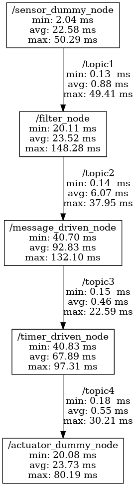

# チェーンレイテンシ

チェーンレイテンシは、パスレイテンシの内訳を示します。[configuration](../../configuration/index.md) で説明されているように、パスレイテンシはノード間データ パスの経過時間とノード内データ パスの経過時間の合計です。チェーン レイテンシは、ノード間データパスとノード内データパスそれぞれで時間がどのようにコストされるかを示します。

```python
from caret_analyze.plot import chain_latency
from caret_analyze import Application, Architecture, Lttng
from bokeh.plotting import output_notebook, figure, show
output_notebook()

arch = Architecture('yaml', '/path/to/architecture_file')
lttng = Lttng('/path/to/trace_data')
app = Application(arch, lttng)
path = app.get_path('target_path')

chain_latency(path, granularity='node', lstrip_s=1, rstrip_s=1)
```



- `granularity`
  - ['raw', 'node'] で視覚化の粒度を変更します。
- `lstrip_s` および `rstrip_s`
  - 不要なデータを削除して注目ポイントを抽出
  - `lstrip_s`は、トレース開始から1秒間のデータが削除されることを意味します。
  - `rstrip_s`は、トレース終了から1秒間のデータが削除されることを意味します。
