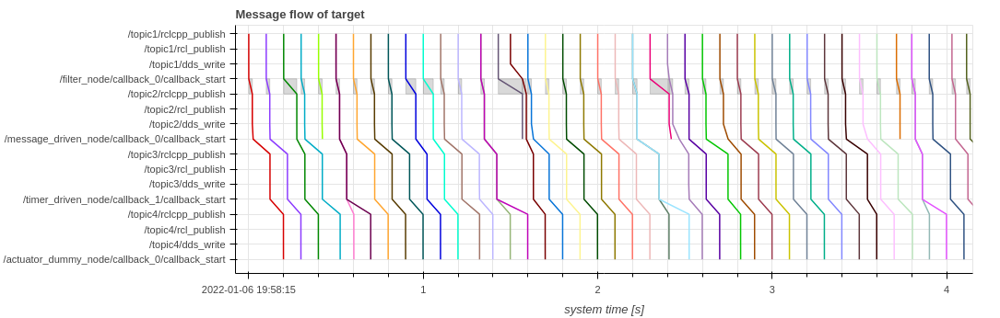

# メッセージフロー

`Plot.create_message_flow_plot()` 関数は、入力メッセージがどのようにノードに受信され、出力メッセージが次のノードに送信されるかを示します。アプリケーションのレスポンスのボトルネックを確認できます。

```python
from caret_analyze.plot import Plot
from caret_analyze import Application, Architecture, Lttng
from bokeh.plotting import output_notebook, figure, show
output_notebook()

arch = Architecture('yaml', '/path/to/architecture_file')
lttng = Lttng('/path/to/trace_data')
app = Application(arch, lttng)
path = app.get_path('target_path')

plot = Plot.create_message_flow_plot(path, granularity='node', lstrip_s=1, rstrip_s=1)
plot.show()
```



横軸は時間を意味し、`Time [s]` とラベル付けされています。
縦軸は、ターゲットパス内のノードとトピックの名前をリストします。色付きの線は入力メッセージに対応し、その伝播を表します。色付きの線をたどると、メッセージ入力が特定のノードでいつ処理されたかを知ることができます。
灰色の四角形はコールバックの実行を示します。

`Plot.create_message_flow_plot()` 関数には次の引数があります。

- `granularity` は、2 つの値でチェーンの粒度を調整するために提供されます。`raw` および `node`
  - `raw`を使用すると、コールバックレベルのメッセージフローが生成されます
  - `node` を使用すると、ノードレベルのメッセージフローが生成されます
- `treat_drop_as_delay` は、ドロップがある場合のフローの次のフローへの接続のブール値です。
- `lstrip_s` はクロップ時間範囲の開始時間を選択するための浮動小数点値です
- `rstrip_s` はトリミング時間範囲の終了時間を選択するための浮動小数点値です

メッセージフロー図では以下のような操作が可能です。

- X 軸を上下にスクロールして、水平方向に拡大または縮小します。
- 垂直方向に拡大または縮小するには、Y 軸上で上または下にスクロールします。
- グラフの上部または下部をスクロールして、水平方向と垂直方向の両方に拡大または縮小します
- メッセージフロー内の線または灰色の四角形の上にマウスを置くと詳細が表示されます
