# 応答時間

CARET のコンテキストでは、応答時間は、ターゲットパスのメッセージ入力からメッセージ出力までにかかる時間が定義されます。
CARET で定義された応答時間に興味がある場合は、[FAQ](../../faq/faq.md#how-response-time-is-calculated) を参照してください。

<prettier-ignore-start>
!!!Note
    システムの入出力には「応答時間」が一般的に使われます。
    したがって、システムの一部を分析する場合（対象パスがエンドツーエンドパスの一部である場合）は、「応答時間」ではなく「パスレイテンシ（ノードレイテンシと通信レイテンシの合計）」と呼ぶ必要があります。
    ただし、このドキュメントでは簡単にするために、両方を「応答時間」と呼びます。
<prettier-ignore-end>

グラフの視覚化として、`case` 引数で 4 つの異なるケースを指定できます。デフォルト値は「すべて」です。「すべて」、「最高」、「最悪」、および「外部遅延を伴う最悪」。

- `all` の場合
  - CARET は、同じサイクル内のすべての入力時刻からの経過時間を表示します。
- `best` の場合
  - CARETは、同じサイクル内のすべての入力時間のうち最短の経過時間を表示します。
- `worst` の場合
  - CARETは、同一サイクル内のすべての入力時間のうち最も長い経過時間を表示します。
- `worst-with-external-latency` の場合
  - CARET は、前のサイクルの最後の入力時刻からの経過時間を表示します。

このセクションでは、応答時間を視覚化する 3 つの方法 `Histogram`、`Stacked Bar`、および `TimeSeries` を示します。
このメソッドを呼び出す前に、次のスクリプト コードを実行してトレース データとアーキテクチャ オブジェクトを読み込みます。

```python
from caret_analyze.plot import Plot
from caret_analyze import Application, Architecture, Lttng
from bokeh.plotting import output_notebook, figure, show
output_notebook()

arch = Architecture('yaml', '/path/to/architecture_file')
lttng = Lttng('/path/to/trace_data')
app = Application(arch, lttng)
path = app.get_path('target_path')
```

## ヒストグラム

次のスクリプトは、応答時間のヒストグラムを生成します。ヒストグラムの横軸は `response time [ms]` とラベル付けされた応答時間を表し、ヒストグラムの縦軸は `The number of samples` を表します。

```python
# plot all case
plot = Plot.create_response_time_histogram_plot(path)
plot.show()
# or
# plot = Plot.create_response_time_histogram_plot(path, case='all')
# plot.show()
```

<prettier-ignore-start>
!!!info
    `output_notebook()` は、Jupyter Notebook 内の図を表示するために必要です。
<prettier-ignore-end>

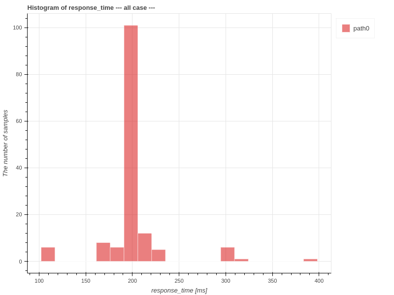

```python
# plot best case
plot = Plot.create_response_time_histogram_plot(path, case='best')
plot.show()
```

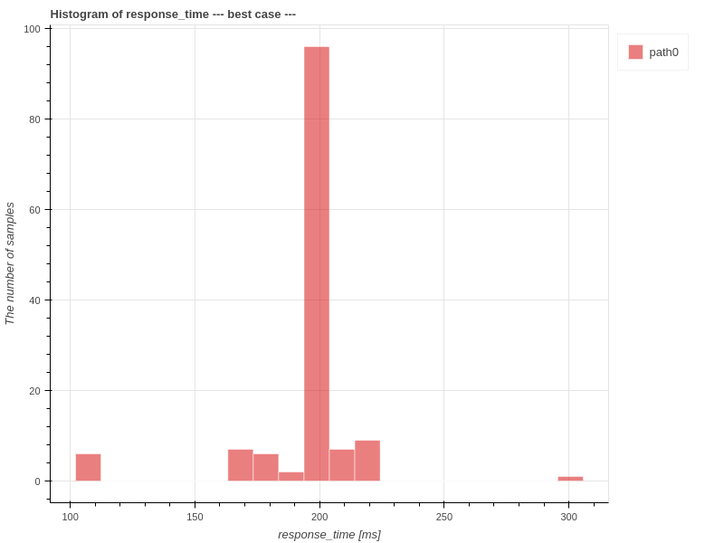

```python
# plot worst case
plot = Plot.create_response_time_histogram_plot(path, case='worst')
plot.show()
```

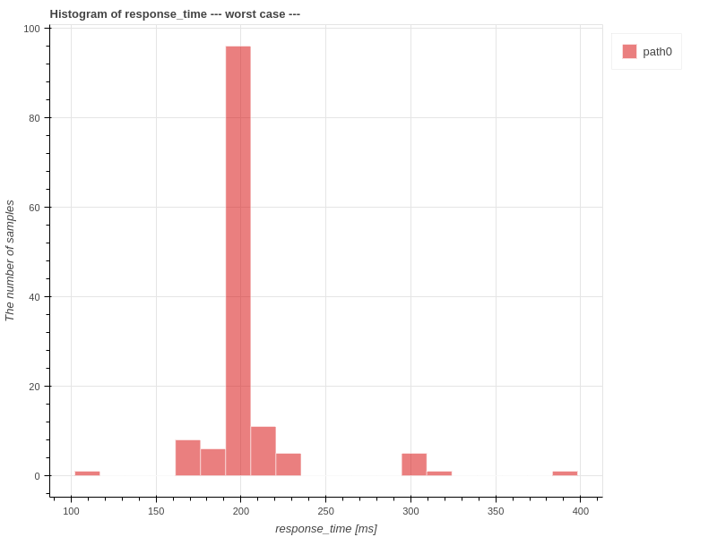

```python
# plot worst-with-external-latency case
plot = Plot.create_response_time_histogram_plot(path, case='worst-with-external-latency')
plot.show()
```

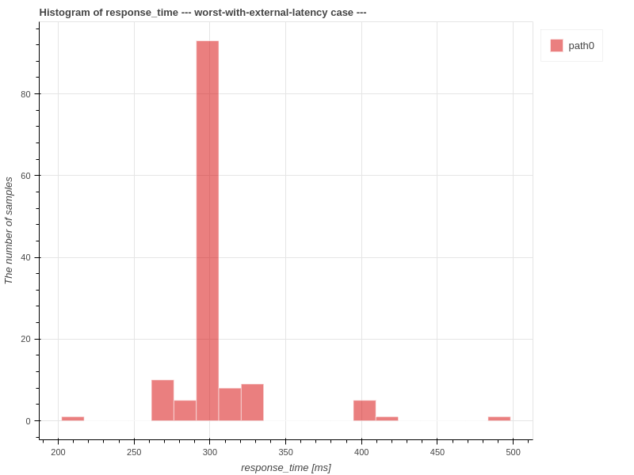

## スタックバー

次のスクリプトは、応答時間のスタックバーグラフを生成します。
スタックバーグラフの横軸は `system time [s]` または `index` を意味し、縦軸は `response time [s]` の各コールバックに経過した時間の内訳を意味します。

```python
# plot all case
plot = Plot.create_response_time_stacked_bar_plot(path)
plot.show()
# or
# plot = Plot.create_response_time_stacked_bar_plot(path, case='all')
# plot.show()
```

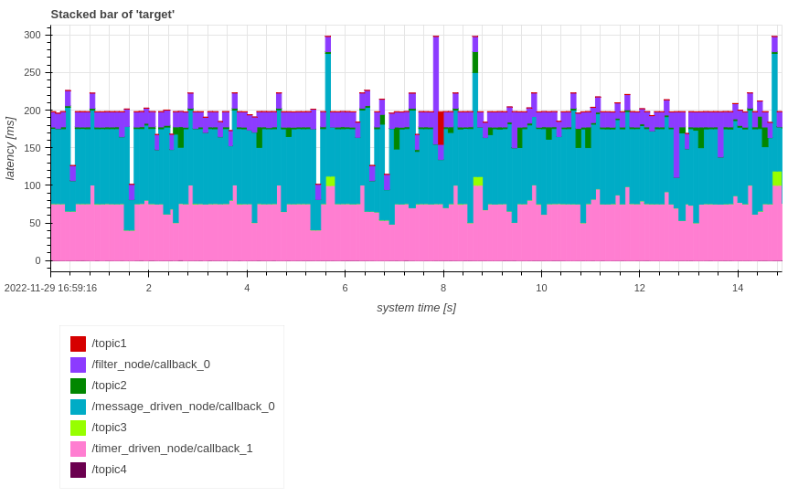

```python
# plot best case
plot = Plot.create_response_time_stacked_bar_plot(path, case='best')
plot.show()
```

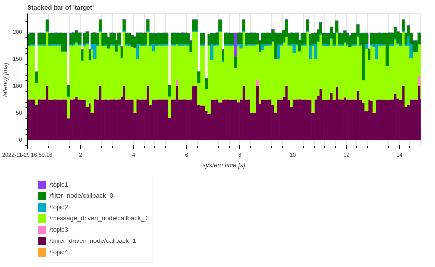

```python
# plot worst case
plot = Plot.create_response_time_stacked_bar_plot(path, case='worst')
plot.show()
```

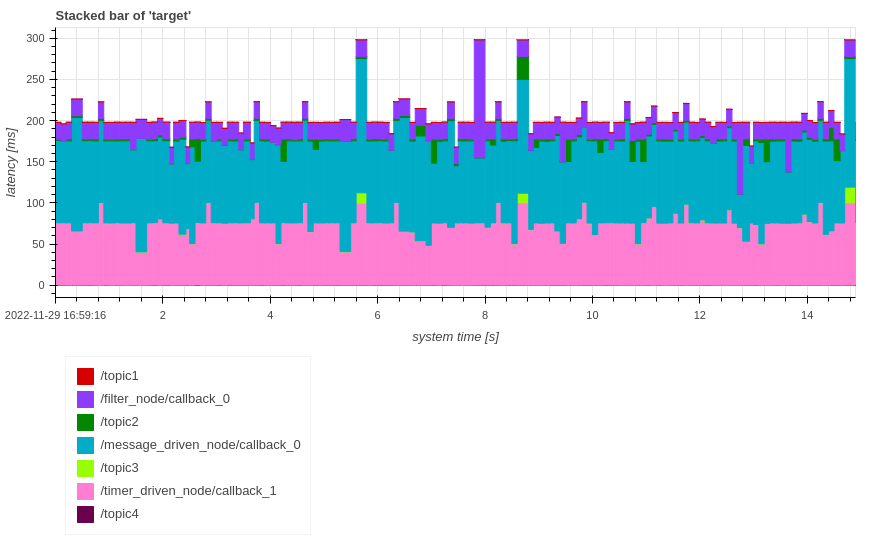

```python
# plot worst-with-external-latency case
plot = Plot.create_response_time_stacked_bar_plot(path, case='worst-with-external-latency')
plot.show()
```

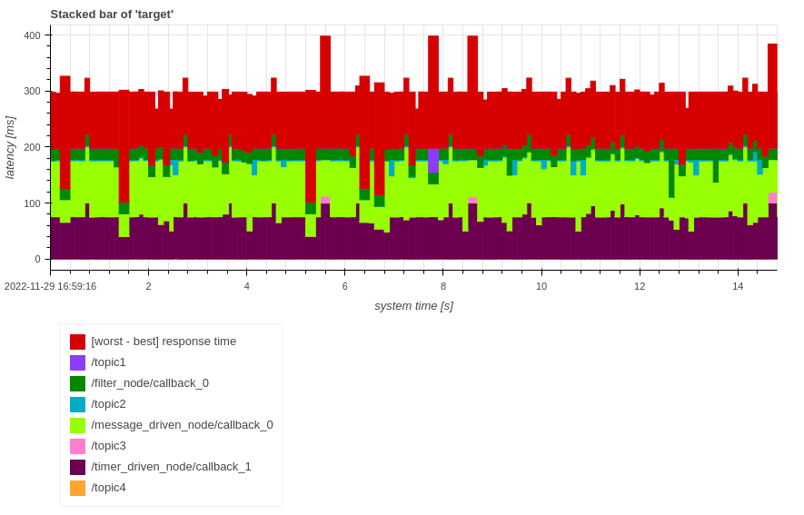

`plot.show()`を`plot.show(xaxis_type='index')`に変更することで、横軸を`system time`または`index`に変更できます。

凡例の `[worst - best] response time` は、最悪の場合と最良の場合の応答時間の差を指します。

## 時系列

次のスクリプトは、応答時間の時系列グラフを生成します。横軸は`system time [s]`または`index`を意味します。縦軸は`Response Time [ms]`を意味します。

```python
# plot all case
plot = Plot.create_response_time_timeseries_plot(path)
plot.show()
# or
# plot = Plot.create_response_time_timeseries_plot(path, case='all')
# plot.show()
```

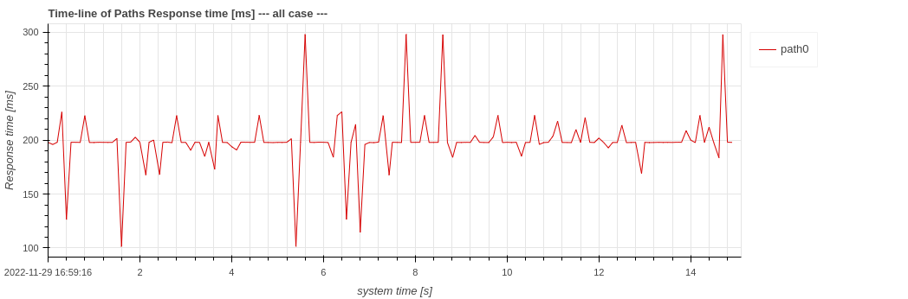

```python
# plot best case
plot = Plot.create_response_time_timeseries_plot(path, case='best')
plot.show()
```

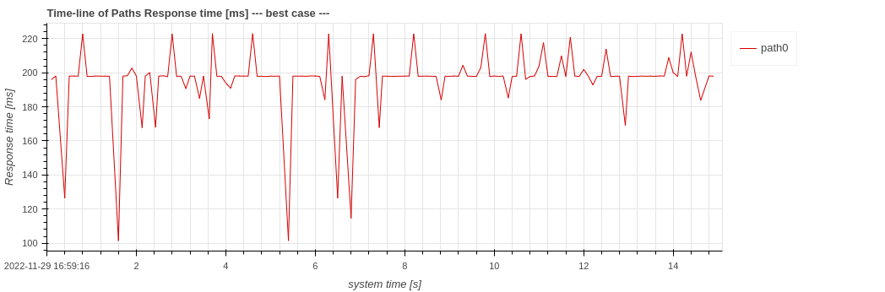

```python
# plot worst case
plot = Plot.create_response_time_timeseries_plot(path, case='worst')
plot.show()
```

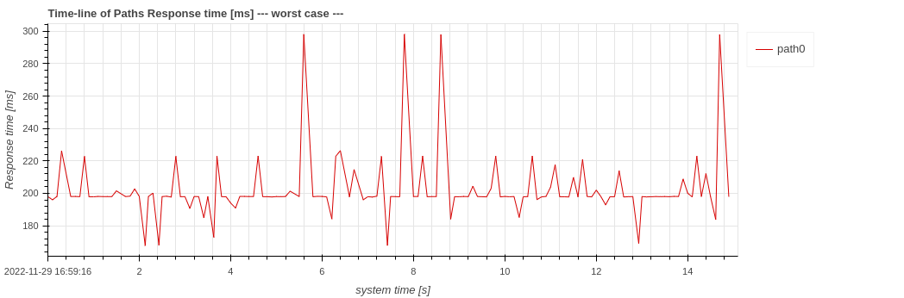

```python
# plot worst-with-external-latency case
plot = Plot.create_response_time_timeseries_plot(path, case='worst-with-external-latency')
plot.show()
```

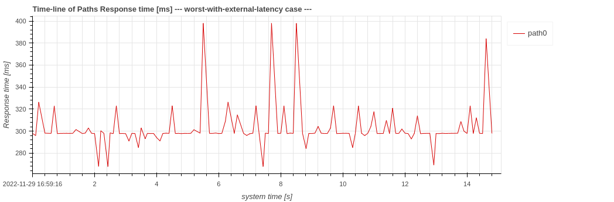

デフォルト値は`system_time`ですが、横軸は`plot.show()`を`plot.show(xaxis_type='index')`に変更することで`system time`または`index`に変更できます。
