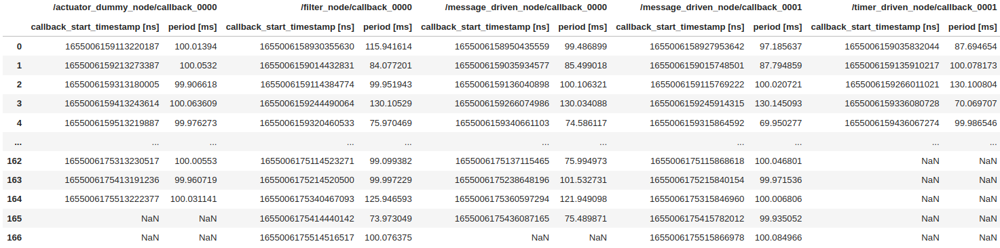
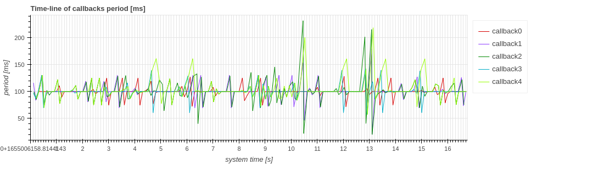
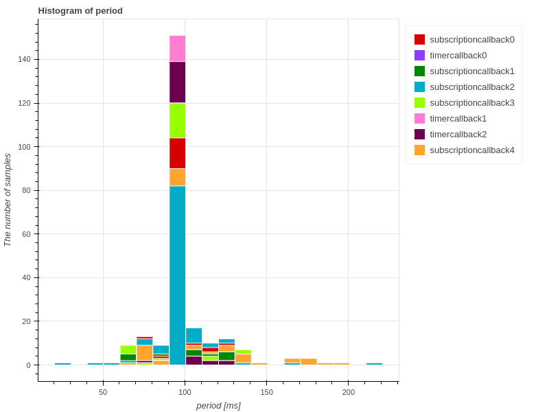
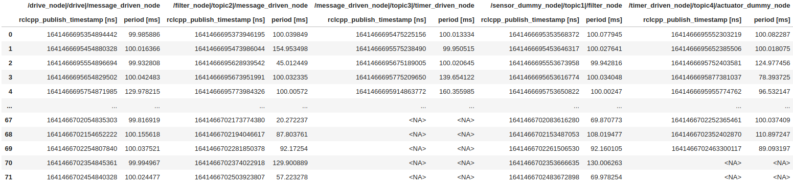
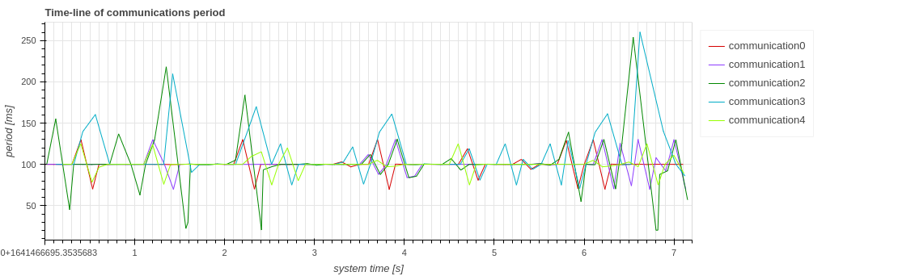
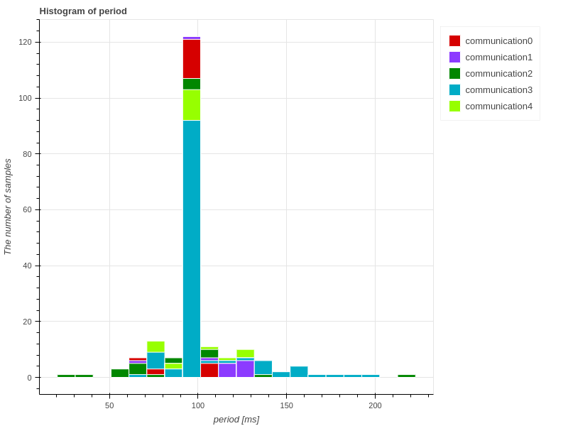
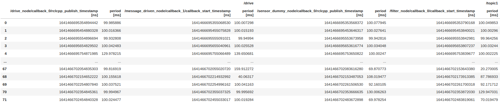
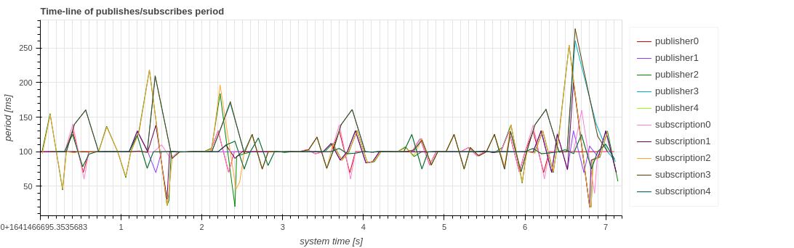

# 期間

CARET は、コールバックの開始、メッセージ送信、パブリッシャーまたはサブスクリプションの呼び出しの期間を表示できます。
`Plot.create_period_timeseries_plot(target_object)` インターフェイスが提供されています。
このセクションでは、それらのサンプル視覚化スクリプトについて説明します。
このメソッドを呼び出す前に、次のスクリプト コードを実行してトレース データとアーキテクチャ オブジェクトを読み込みます。

```python
from caret_analyze.plot import Plot
from caret_analyze import Application, Architecture, Lttng
from bokeh.plotting import output_notebook, figure, show
output_notebook()
arch = Architecture('yaml', '/path/to/architecture_file')
lttng = Lttng('/path/to/trace_data')
app = Application(arch, lttng)
```

## Callback

`Plot.create_period_timeseries_plot(callbacks: Collections[CallbackBase])` と `Plot.create_period_histogram_plot(callbacks: Collections[CallbackBase])` は、コールバック関数の呼び出し間隔をチェックするために導入されました。期間は頻度よりも詳細な指標です。

```python
### Timestamp tables
plot = Plot.create_period_timeseries_plot(app.callbacks)
period_df = plot.to_dataframe()
period_df

# ---Output in jupyter-notebook as below---
```



### 時系列

```python
### Time-series graph
plot = Plot.create_period_timeseries_plot(app.callbacks)
plot.show()

# ---Output in jupyter-notebook as below---
```



横軸は時間を意味し、`Time [[_FIX_ID_0_]], and 0-based ordering. One of `'system_time'[​​[_FIX_ID_2_]]'sim_time'[​​[_FIX_ID_3_]]'index'` is chosen as `xaxis_type` though `'system_time'` とラベル付けされており、デフォルト値です。
縦軸はコールバック開始の期間を意味し、`Period [ms]` とラベル付けされています。サンプルごとにプロットされます。

### ヒストグラム

```python
### histogram graph
plot = Plot.create_period_histogram_plot(app.callbacks)
plot.show()

# ---Output in jupyter-notebook as below---
```



横軸は期間を表し、`period [ms]` というラベルが付けられます。縦軸は各期間で実行されるサンプル数を表し、`The number of samples` というラベルが付けられます。

＃＃ コミュニケーション

`Plot.create_period_timeseries_plot(communications: Collection[Communication])`と`Plot.create_period_histogram_plot(communications: Collection[Communication])`は、通信周期が安定しているかどうかを確認したい場合に役立ちます。
ここで、CARET は、メッセージの送信と受信の両方が失われずに正常に実行された場合の通信を考慮しています。
詳細については、[Premise of communication](../premise_of_communication.md) を参照してください。

```python
### Timestamp tables
plot = Plot.create_period_timeseries_plot(app.communications)
period_df = plot.to_dataframe()
period_df

# ---Output in jupyter-notebook as below---
```



### 時系列

```python
### Time-series graph
plot = Plot.create_period_timeseries_plot(app.communications)
plot.show()

# ---Output in jupyter-notebook as below---
```



横軸は時間を意味し`Time [s]`と表記し、縦軸はあるメッセージの通信から次のメッセージの通信までの期間を`Period [ms]`と表記します。`xaxis_type` 引数とコールバック実行が提供されます。

### ヒストグラム

```python
### Histogram graph
plot = Plot.create_period_histogram_plot(app.communications)
plot.show()

# ---Output in jupyter-notebook as below---
```



横軸は期間を表し、`period [ms]` というラベルが付けられます。縦軸は各期間で実行されるサンプル数を表し、`The number of samples` というラベルが付けられます。

## パブリッシュとサブスクリプション

`Plot.create_period_timeseries_plot(Collection[publish: Publisher or subscription: Subscriber])` は、パブリッシャーまたはサブスクリプションの呼び出しサイクルがどの程度安定しているかを確認するのに役立ちます。

```python
### Timestamp tables
plot = Plot.create_period_timeseries_plot(*app.publishers, *app.subscriptions)
period_df = plot.to_dataframe()
period_df

# ---Output in jupyter-notebook as below---
```



```python
### Time-series graph
plot = Plot.create_period_timeseries_plot(*app.publishers, *app.subscriptions)
plot.show()

# ---Output in jupyter-notebook as below---
```



横軸は `Time [s]` とラベル付けされた時間を意味し、縦軸は `Period [ms]` とラベル付けされたパブリッシュまたはサブスクリプションの呼び出し期間を意味します。`xaxis_type` 引数も用意されています。
