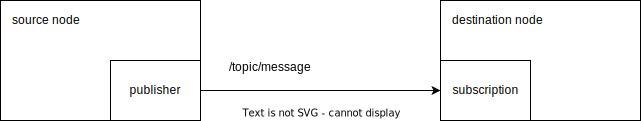
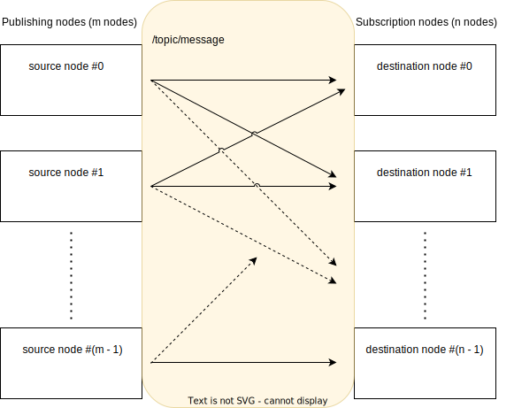

# コミュニケーションの前提

## 1対1のコミュニケーション

<prettier-ignore-start>
!!!info
    この前提セクションは一部のユーザーにとって退屈かもしれません。時間がない場合は、このセクションをスキップしてください。
<prettier-ignore-end>

ROS 2 では、ノードはトピックメッセージを介して相互に通信します。トピック メッセージはパブリッシャによって送信され、サブスクリプションによって受信されます。次の図は、1 つのノードがトピックメッセージを送信し、もう 1 つのノードがそれを受信する最も単純な例を示しています。

CARET は、送信元ノードから宛先ノードへのトピックメッセージに焦点を当てた `Communication` クラスを提供します。`Communication` ベースのオブジェクトがメソッド `Application.get_communication('source node', 'destination node', '/topic/message')` から取得されます。`Communication` オブジェクトには、ターゲットメッセージのパブリッシュとサブスクリプションの両方が正常に実行されたときに取得されるタイムスタンプのコレクションが含まれます。`Communication`クラスについてはページ内で説明しています。

トピックメッセージはUDPで送受信されるため、通信路で消失する可能性があります。`Communication` オブジェクトは、トピック メッセージの損失を無視します。トピックメッセージの損失を確認したい場合は、パブリッシュ数とサブスクリプション数を比較するのが合理的です。CARET は、`Publish` クラスと `Subscription` クラスの両方に対応します。`Publish` オブジェクトには、パブリッシュが呼び出されたときに取得されたタイムスタンプのコレクションが含まれます。`Subscription` オブジェクトには、サブスクリプションコールバックの呼び出しのタイムスタンプが含まれています。

## 多対多の通信

ROS 2 を使用すると、トピックメッセージを複数のノードから発行し、複数のノードで受信できるようになります。同じトピックを共有するトピックメッセージは、下図のように多くのノード間で送受信されます。

多対多通信のパフォーマンスを調査したい場合は、CARET が 1 対 1 通信に分割し、1 対 1 通信のセットを選択するため、パブリッシュとサブスクリプションのペアを選択する必要があります。ターゲット通信ごとに`Application.get_communication()`を実行します。

### 多 対 1 通信の制約

CARET では、ユーザーが多 対 1 の通信を行う必要があります。多 対 1 通信とは、次の図に示すように、トピック メッセージが複数のノードから発行され、単一のノードで受信されることを意味します。

この場合、ソースノードでのパブリッシュの呼び出し頻度と、宛先ノードでのサブスクリプションの呼び出し頻度は異なります。宛先 この場合、ソースノードでのパブリッシュの呼び出し頻度は、宛先ノードでのサブスクリプションの呼び出し頻度と異なります。宛先ノードは、他の 2 つのノードからトピック メッセージを受信します。3 つのノードのパブリッシュ頻度の合計がサブスクリプションの頻度と等しいことが期待されます。ノードは他の 2 つのノードからトピックメッセージを受信します。3 つのノードのパブリッシュ頻度の合計がサブスクリプションの頻度と同じになることが期待されます。

パブリッシュの頻度がサブスクリプションの頻度と異なる場合は、トピックメッセージが失われていると考えられるかもしれません。ただし、多 対 1 の通信を行う場合には合理的です。
