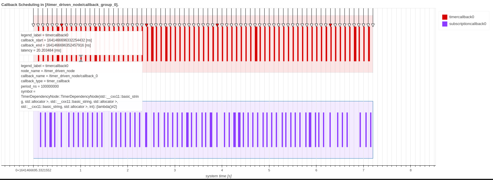
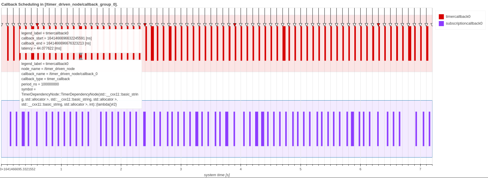

# コールバック スケジューリングの視覚化

関数 `Plot.create_callback_scheduling_plot()` は、ノード、パス、エグゼキューター、コールバックグループなどのターゲットのコールバックスケジューリングを視覚化します。
このセクションでは、それらのサンプル視覚化スクリプトについて説明します。
このメソッドを呼び出す前に、次のスクリプト コードを実行してトレースデータとアーキテクチャオブジェクトを読み込みます。

```python
from caret_analyze import Architecture, Application, Lttng
from caret_analyze.plot import Plot

arch = Architecture('lttng', './e2e_sample')
lttng = Lttng('./e2e_sample')
app = Application(arch, lttng)
```

```python
### target: node
node = app.get_node('node_name') # get node object
plot_node = Plot.create_callback_scheduling_plot(node)
plot_node.show()

# ---Output in jupyter-notebook as below---
```



```python
### target: callback group
cbg = app.get_callback_group('cbg_name') # get callback group object
plot_cbg = Plot.create_callback_scheduling_plot(cbg)
plot_cbg.show()

# ---Output in jupyter-notebook as below---
```



```python
### target: executor
executor = app.get_executor('executor_name') # get executor object
plot_executor = Plot.create_callback_scheduling_plot(executor)
plot_executor.show()

# ---Output in jupyter-notebook as below---
```


- コールバックスケジューリングの視覚化
  - 色付きの四角形はコールバックの実行時間 (callback_start から callback_end) を示します。
  - 半透明の色の領域にマウスを置くと、コールバックに関する情報が表示されます。
- タイマーイベントの視覚化
  - 矢印はタイマコールバックの予想される開始タイミングです
  - タイマコールバックが遅れて開始される場合 (5 ミリ秒以上)、矢印が赤に変わります (時間通りであれば白)
